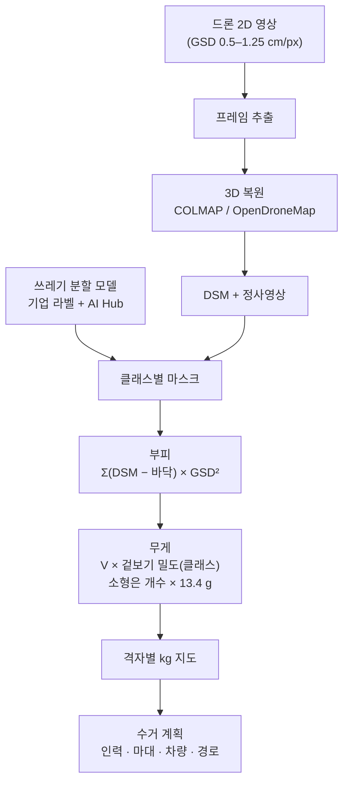

# 02. 선행연구 종합 — 드론 2D 영상 → 3D 복원 → 부피·무게 → 수거 계획

> 해커톤 시작 시점(2026-09-30)에 정리한 선행연구 조사. 데이터셋, 3D 복원 기술 비교, 부피→무게 방법, 수거 계획 연결, 한계까지.
> 핵심 논문 2편은 따로 자세히 정리했다: [03 Kako et al. 2020](03_논문정리_Kako2020.md) · [04 Andriolo et al. 2024](04_논문정리_Andriolo2024.md)

## 1. 핵심 논문 5편

| 논문 | 무엇을 했나 | 이 프로젝트에 주는 것 |
|---|---|---|
| **Kako et al. (2020)** [1] *Mar. Pollut. Bull.* 155 | DJI Phantom 4 → **SfM 3D 모델·정사영상** → 딥러닝 플라스틱 검출 → **부피 계산**. 크기 아는 물체로 검증, **오차 5 % 미만**(평평한 모래 해변·보정 완료). 실제 자갈 해변에선 약 29 % 과소추정 | 가장 직접적인 선행연구. "드론 + SfM + 딥러닝으로 부피"가 된다는 근거. 단, **무게·수거계획까지는 안 감** |
| **Andriolo et al. (2024)** [2] *Mar. Pollut. Bull.* 202 | 드론 영상으로 **무게 추정 3가지** 비교 (실측 1,505개 · 24.72 kg). W1 종류별 평균무게 / W2 일괄 평균(약 14 g/개, **정확도 약 80 %**) / W3 면적 × 가정 두께 × 밀도 | W3는 두께를 **임의로 가정**해야 해서 실용성이 떨어진다고 결론 → **3D로 실제 높이를 재면 이 한계를 정면으로 해결**. 발표의 핵심 논거 |
| **Andriolo & Gonçalves (2024)** [3] *Environ. Pollut.* 361 | 80편 문헌·693개 해변 메타분석. 해안쓰레기 1개 평균 **19.5 g**, 중앙값 **13.4 g**. 플라스틱은 개수로 80 %, 무게로 51 % | 3D로 못 재는 **작은 쓰레기의 대체값**. 결과 검증 기준값 |
| **Song et al. (2022)** [4] *Sustainability* 14(14) | 국내 해안. 접근 어려운 해안을 드론 촬영 → U-Net 분할(F1 ≈ 0.74). 1,295개 중 **스티로폼 76.4 %** | 국내 해안 구성 근거. 스티로폼은 부피는 크고 무게는 가벼움 → **무게 변환이 꼭 필요한 이유** |
| **Andriolo et al. (2023)** [5] *Mar. Pollut. Bull.* 195 | 쓰레기 드론 촬영 적정 해상도 **0.5–1.25 cm/px**, Phantom 4 Pro 기준 고도 18–46 m, 최소 탐지 크기 2.5–5 cm | 촬영 조건 설계 근거 |

**함께 볼 연구**
- **Gonçalves et al. (2022)** [6] — 드론 해변쓰레기 조사 15건 리뷰. 비행 조건 통일은 어렵고 대신 **격자 지도로 결과를 표준화**하자고 제안 → 수거계획 지도를 격자 단위로 만드는 근거
- **Winans et al. (2023)** [7] — 하와이 해안 1,900 km 항공영상 쓰레기 검출. 정밀도 72 %, **재현율 40 %** → 검출 누락이 무게 과소추정으로 이어진다는 점을 한계로 명시해야 함. 이 데이터(Zenodo 8381113)는 ①·③ 단계 검증에 실제로 썼다
- 국내 연구·사례 — 드론 및 AI를 이용한 해안 쓰레기 모니터링 체계(DBpia), 위성 및 드론 영상을 이용한 해안쓰레기 모니터링(DBpia), 드론을 활용한 수거사각지대 해양쓰레기 탐지(KCI)

## 2. 데이터셋

메인 데이터는 **기업 제공 라벨 데이터**(문갑도), 공개 데이터는 보조(사전학습·부족 클래스 보강·일반화 검증)로 썼다.

| 데이터셋 | 규모 · 라벨 | 촬영 | 용도 |
|---|---|---|---|
| **AI Hub 해안 오염물질** [8] | 426,246장 · bbox + polygon · 12종 (스티로폼 부표·박스, 플라스틱 부표, 어망, 로프, PET병, 유리, 금속 등) | 드론 중심 (2021) | 보조 학습. 클래스마다 밀도를 다르게 주는 방법과 맞음. ③ 단계에서 거리별(2~4 cm/px) 학습셋으로 사용 |
| **UAVVaste** [9] | 772장 · 3,718개 · COCO bbox + mask | 저고도 드론 | 일반화 검증 (Apache-2.0) |
| **BePLi v1** [10] | 해변 플라스틱 인스턴스 분할 | 해변 영상 | 플라스틱 세부 분할 보강 |
| AI Hub 해양침적쓰레기 [11] | 약 11만 장 · 9종 | 수중 | 드론 아님 — 참고만 |

> 공개 데이터셋은 대부분 **낱장 사진**이라 3D 복원용 다각도 연속 영상이 아니다. 3D 검증용 영상은 크기·무게를 아는 물체를 놓고 **직접 촬영**했다 (Kako et al.도 같은 방식).

### 기업 데이터 수령 체크리스트 (⭐ = 파이프라인 성립을 가르는 항목)

1. **영상 형태** — ⭐ 연속 영상·겹치는 사진인가, 낱장인가 (낱장이면 SfM 불가) · ⭐ 같은 장소를 여러 각도에서 찍었나 · 정사영상/DSM/점군이 이미 있나 · GSD
2. **스케일** — ⭐ EXIF에 GPS·고도·초점거리가 있나 · GCP/RTK 여부 (없으면 높이 오차 최대 90 cm 사례) · 기종
3. **라벨** — ⭐ 박스인가 폴리곤·마스크인가 (박스만이면 SAM으로 마스크) · 클래스가 재질별로 나뉘었나 · 포맷 · 원본 프레임/정사영상 중 어디에 달렸나
4. **정답** — ⭐ 실측 무게·크기·부피가 있나 · 수거 기록(kg, 마대 수)이 있나
5. **조건** — 외부 데이터·사전학습 모델 사용 가능 여부 · 평가 기준

## 3. 2D 영상 → 3D 복원 기술 비교

드론은 움직이며 찍기 때문에 프레임끼리 시점이 조금씩 다르다(시차) → 이걸로 3D를 복원한다.

| 방법 | 대표 도구 | 장점 | 단점 | 판단 |
|---|---|---|---|---|
| **SfM + MVS 사진측량** | COLMAP [14] · OpenDroneMap | 검증된 표준. DSM·정사영상이 바로 나옴. Kako(2020)도 이 방식 | 처리 시간 김. 무늬 없는 모래·물 위에서 매칭 실패 가능 | ✅ 메인 (③ 단계에서 pycolmap SfM + COLMAP CUDA 조밀 복원) |
| **피드포워드 3D 복원** | VGGT [15] (CVPR 2025) · MASt3R | 카메라 자세·깊이·점군을 수 초 만에 예측 | 실제 스케일(m)이 없음 → GPS·기준물로 보정. VGGT 원본은 비상업 라이선스 | 빠른 시연·백업 후보 |
| **3D Gaussian Splatting** | 3DGS [16] | 보기 좋은 3D 화면 | 렌더링용이라 정밀 측정엔 부적합 | 시연 시각화용 |
| **단안 깊이 추정** | Depth Anything V2 [17] | 사진 1장으로 깊이 | 드론 시점 zero-shot 상대오차 80–98 % 사례 [18] | ❌ 부피용 비추천 |

> **가장 중요한 함정은 스케일.** 영상만으로 만든 3D는 모양은 맞아도 실제 크기를 모른다. 부피는 길이의 세제곱이라 **스케일 10 % 오차 → 부피 약 33 % 오차.**
> 대응: ① 드론 GPS·고도 메타데이터(SRT) ② 크기를 아는 기준물 함께 촬영 ③ 둘 다 쓰고 교차검증. ③ 단계 `litter/volume.py`는 수평 이동이 10 m 이상이면 GPS 궤적으로, 아니면 SRT 고도로 축척을 정한다.

## 4. 부피 → 무게

### 4-1. 부피 (DSM 차분)

```
부피 V = Σ (마스크 안 각 픽셀) max(DSM 높이 − 바닥 높이, 0) × GSD²
바닥 높이 = 마스크 바깥 테두리(링) 모래 높이로 평면을 맞춰 추정
```

정사영상 위 폴리곤을 같은 좌표의 DSM에 그대로 겹치면 2D 라벨이 3D와 연결된다. 프레임 간 라벨 전파는 SAM 2를 쓸 수 있다 (③ 단계 `objvol.py`는 여러 프레임의 SAM 2 마스크를 투표해 물체 점만 고른다).

### 4-2. 무게 — "겉보기 밀도"가 핵심

3D로 잰 부피는 **겉 부피(외피)**다. PET병·부표는 속이 비어 있어서 재료 밀도(PET 1.38 g/cm³)를 곱하면 **수십 배 과대추정**된다. 그래서 클래스별 **겉보기 밀도 ρ_app = 실제 무게 ÷ 겉 부피**를 쓰고, 최소~최대 범위를 같이 낸다.

| 클래스 | 재료 밀도 (참고) | 처리 |
|---|---|---|
| 스티로폼 부표·박스·조각 | EPS 발포 11–32 kg/m³ [19] | 속이 꽉 찬 발포체 → 재료 밀도 ≈ 겉보기 밀도. 가장 정확한 클래스 (국내 해안 76 %가 스티로폼) |
| PET병 · 플라스틱 부표 · 기타 플라스틱 | 0.8–1.5 g/cm³ | 속이 빔 → 보정 필요 (실물 무게 ÷ 겉 부피) |
| 어망 · 로프 | PE/PP 1 g/cm³ 내외 | 구멍·틈이 많음 → 채움률 보정. 젖으면 물·모래 무게 추가 |
| 유리 · 금속 | 높음 | 병·캔은 속이 빔 → 개당 평균무게(W1)가 더 안정적 |
| 3D로 못 재는 작은 것 | — | 개수 × 중앙값 13.4 g [3] (Andriolo W2 방식) |

> 해커톤용 보정 실험: 클래스별 실물 5–10개를 저울 무게와 3D 부피로 같이 재서 ρ_app 표를 직접 만든다. 현재 표의 상당수는 가정값이며 출처·가정 여부를 코드에 표기했다.

## 5. 수거 계획으로 연결

| 판단 | 기준 | 출력 예 |
|---|---|---|
| 개별 물체: 사람 or 장비 | NIOSH 들기 공식 권장 한계 **23 kg** [20] — 미만 1인, 이상 2인 이상/장비 | "이 구역 대형물 3개 → 2인조" |
| 총량 → 자재·차량 | 구역 총 무게 ÷ 마대·톤백·트럭 적재량 | "마대 40개, 1톤 트럭 2회" |
| 부피도 같이 본다 | 스티로폼은 가벼워도 부피가 커서 적재 부피가 먼저 찬다 | "무게로는 1대, 부피로는 3대" |
| 우선순위 지도 | 격자별 kg 합계 히트맵 — 격자 표준화 제안 [6] | "무거운 격자부터" |
| 수거 경로 | 적재량 제약 차량경로문제(CVRP) [21] | "집하장 → A → C → B" |

④ 단계 ShoreSweep Planner는 여기서 더 나아가 정사영상 색으로 물·숲·맨땅 격자를 만들어 **지형 최단경로**로 구역 순서를 정하고, 하루 작업시간으로 일차를 나눈다.

## 6. 처음 설계한 파이프라인



이후 "해안 전체를 매번 다 날 수 없다"는 문제가 더해져, 앞단에 **위성·해류 기반 우선 구간 선정과 경로 최적화**(①②)를 붙인 것이 최종 파이프라인이다.

## 7. 한계와 대응

| 한계 | 왜 문제인가 | 대응 |
|---|---|---|
| 물 위 부유쓰레기 | 수면이 움직여 SfM 매칭이 안 됨 | 해안쓰레기(수거량 77 %)로 범위 한정 |
| 스케일 오차 | 길이 10 % → 부피 약 33 % | GPS + 기준물 교차검증, 오차를 결과에 표기 |
| 모래에 묻히거나 가려진 부분 | 보이는 부분만 측정 → 과소추정 | "최소 추정치"로 표기 + 범위 출력 |
| 속 빈·젖은 물체 | 겉 부피 ≠ 무게 | 클래스별 겉보기 밀도 + 젖음 계수 |
| 검출 누락 | 재현율 40 % 사례 [7] | 재현율을 같이 보고, 누락 보정 검토 |

## 참고문헌

**핵심 선행연구**
1. Kako, S., Morita, S., & Taneda, T. (2020). Estimation of plastic marine debris volumes on beaches using unmanned aerial vehicles and image processing based on deep learning. *Marine Pollution Bulletin*, 155, 111127. doi:10.1016/j.marpolbul.2020.111127
2. Andriolo, U., Gonçalves, G., Hidaka, M., Gonçalves, D., Gonçalves, L.M., Bessa, F., & Kako, S. (2024). Marine litter weight estimation from UAV imagery: Three potential methodologies to advance macrolitter reports. *Marine Pollution Bulletin*, 202, 116405. doi:10.1016/j.marpolbul.2024.116405
3. Andriolo, U., & Gonçalves, G. (2024). How much does marine litter weigh? A literature review to improve monitoring, support modelling and optimize clean-up activities. *Environmental Pollution*, 361, 124863. doi:10.1016/j.envpol.2024.124863
4. Song, K., Jung, J.-Y., Lee, S.H., Park, S., & Yang, Y. (2022). Assessment of marine debris on hard-to-reach places using unmanned aerial vehicles and segmentation models based on a deep learning approach. *Sustainability*, 14(14), 8311. doi:10.3390/su14148311
5. Andriolo, U., Topouzelis, K., van Emmerik, T.H.M., et al. (2023). Drones for litter monitoring on coasts and rivers: suitable flight altitude and image resolution. *Marine Pollution Bulletin*, 195, 115521. doi:10.1016/j.marpolbul.2023.115521
6. Gonçalves, G., Andriolo, U., Gonçalves, L.M.S., Sobral, P., & Bessa, F. (2022). Beach litter survey by drones: Mini-review and discussion of a potential standardization. *Environmental Pollution*, 315, 120370. doi:10.1016/j.envpol.2022.120370
7. Winans, W.R., Chen, Q., Qiang, Y., & Franklin, E.C. (2023). Large-area automatic detection of shoreline stranded marine debris using deep learning. *Int. J. Applied Earth Observation and Geoinformation*, 124, 103515. doi:10.1016/j.jag.2023.103515

**데이터셋**
8. AI Hub. 해안 오염물질 데이터 (2021 구축, 2022 갱신). https://aihub.or.kr/aihubdata/data/view.do?currMenu=115&topMenu=100&dataSetSn=506
9. Kraft, M., Piechocki, M., Ptak, B., & Walas, K. (2021). Autonomous, onboard vision-based trash and litter detection in low altitude aerial images collected by an unmanned aerial vehicle. *Remote Sensing*, 13(5), 965. — UAVVaste https://github.com/PUTvision/UAVVaste
10. Hidaka, M., et al. (2023). BePLi Dataset v1. *Data in Brief*, 48, 109176. doi:10.1016/j.dib.2023.109176
11. AI Hub. 해양침적쓰레기 이미지 데이터 고도화 (2022). https://aihub.or.kr/aihubdata/data/view.do?currMenu=115&topMenu=100&dataSetSn=71340

**통계 · 기사**
12. 뉴시스 (2025-09-24). 해양쓰레기 증가세…최근 5년간 64.9만톤 수거. https://www.newsis.com/view/NISX20250924_0003341637
13. 머니투데이 (2026-09-12). 해양폐기물 수거량 4년간 2만3879t↑. https://www.mt.co.kr/politics/2026/09/12/2026091215001061878

**3D 복원 · 비전**
14. Schönberger, J.L., & Frahm, J.-M. (2016). Structure-from-Motion Revisited. *CVPR*. — COLMAP
15. Wang, J., et al. (2025). VGGT: Visual Geometry Grounded Transformer. *CVPR*. https://github.com/facebookresearch/vggt
16. Kerbl, B., Kopanas, G., Leimkühler, T., & Drettakis, G. (2023). 3D Gaussian Splatting for Real-Time Radiance Field Rendering. *ACM TOG*, 42(4). doi:10.1145/3592433
17. Yang, L., et al. (2024). Depth Anything V2. arXiv:2406.09414
18. Song, Z., Chen, G., et al. (2026). AerialMetric: Benchmarking and Adapting UAV Monocular Metric Depth Estimation in the Real World. *ECCV 2026*. arXiv:2606.29716

**물성 · 작업 기준**
19. Wikipedia. Polystyrene — EPS 밀도
20. NIOSH. Applications Manual for the Revised NIOSH Lifting Equation. https://stacks.cdc.gov/view/cdc/110725
21. Google OR-Tools. Capacitated Vehicle Routing Problem. https://developers.google.com/optimization/routing/cvrp

그 외 도구: OpenDroneMap · MASt3R · SAM 2
