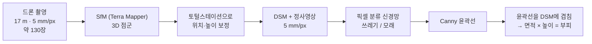

# 03. 논문 정리 — Kako et al. (2020) 드론 + SfM + 딥러닝 해양쓰레기 부피 추정

> **서지** — Kako, S., Morita, S., & Taneda, T. (2020). Estimation of plastic marine debris volumes on beaches using unmanned aerial vehicles and image processing based on deep learning. *Marine Pollution Bulletin*, 155, 111127. doi:10.1016/j.marpolbul.2020.111127
> 일본 가고시마대학교 해양토목공학과. 괄호 안 (p.N)은 원문 쪽수.

## 3줄 요약

1. 드론 사진 약 130장 → SfM으로 **DSM(표면 높이지도) + 정사영상** → 쓰레기 픽셀을 찾아 **윤곽선 안 면적 × 높이로 부피** 계산.
2. 크기를 아는 테스트 쓰레기로 검증: 평평한 모래 해변에서 **오차 1~6 %**(보정이 잘 된 날), 보정이 불완전한 날은 +13~16 %.
3. 흰·회색 **자갈 해변(실제 쓰레기)에서는 약 29 % 과소추정** — 색만으로 쓰레기를 구분하는 방식의 한계.

## 1. 연구 배경 (p.1–2)

- 해변 쓰레기 조사는 대부분 사람이 직접 해서 조사자마다 결과가 다르고(주관성), 인건비·시간 때문에 자주 하기 어렵다.
- 기존 방법의 한계: 웹캠은 2D 면적만, 소형 비행기는 비쌈, 풍선 촬영은 이동성이 나쁨, LiDAR는 장비가 비쌈.
- 당시 드론 + AI 쓰레기 연구는 Martin et al. (2018), Fallati et al. (2019) 두 편뿐이고 둘 다 **개수**만 셌다. 3D 정보(부피)는 없었다.
- 목표: 드론 + 딥러닝 이미지 처리로 **5 cm보다 큰** 해변 쓰레기의 **부피** 추정.

## 2. 방법

### 촬영 설정 (p.2)

| 항목 | 값 |
|---|---|
| 기체 | DJI Phantom 4 (4K, GPS) |
| 메타데이터 | EXIF에 GPS·기압 고도·ISO·초점거리·셔터속도 |
| 비행 계획 | DJI Ground Station PRO (무료 iPad 앱) |
| GSD | **5 mm/px** → 고도 **17 m** (더 높으면 페트병이 안 보이고, 더 낮으면 조종이 어려움, p.4) |
| 속도 · 중복도 | 1 m/s, 가로 90 % · 세로 60 % |
| 배터리 1회 | 약 15분, 약 100 m × 100 m |
| 장소 | 고시키지마 섬 후키아게 해변(모래, 평평) · 사토 해변(흰·회색 자갈) |

### 지상기준점과 보정 (p.2, p.5)

- 해변에 대공표지를 지상기준점(GCP)으로, 입체 표지를 높이 보정용으로 설치하고 토털스테이션(2.2 mm/100 m)으로 측량.
- **보정하지 않으면 수평 최대 30 cm, 높이 최대 90 cm 과대추정** (Fig. 6) → 페트병·부표 부피를 재기엔 너무 큰 오차. 저자들은 보정을 강력히 권고.

### 3D 복원 (p.2)

상용 SfM(Terra Mapper)으로 ① 3D 점군(드론 위치·고도·초점거리로 각 점의 경위도·고도 계산) → ② 점군 보간으로 DSM → ③ DSM으로 5 mm/px 정사영상. 정사영상은 색·형태를 읽는 2D 자료, DSM은 같은 위치의 높이를 읽는 3D 자료로 역할이 나뉜다.

### 쓰레기 픽셀 분류 (p.2–4)

이름은 딥러닝이지만 실제로는 **픽셀 하나의 색(HSV)만 보는** 작은 완전연결 신경망이다. 모양·주변 맥락은 보지 않는다.

| 항목 | 내용 |
|---|---|
| 문제 | 픽셀 이진 분류 (쓰레기 1 / 모래 0) |
| 입력 | RGB → HSV, 256차원 원-핫 |
| 구조 | 은닉층 16-16 (ReLU) + sigmoid 출력 |
| 학습 | binary cross-entropy, RMSprop, 20 에폭, 배치 512, 학습 7만 / 검증 4만 픽셀 |
| 라벨링 | GIMP로 모래 부분을 검게 칠함 |
| 결과 | 학습 정확도 0.98, 과적합 없음 (Fig. 7) |

### 부피 계산 (p.2, p.6–7)

신경망 결과에서 Canny로 윤곽선을 찾고, 같은 좌표계의 **DSM 위에 겹쳐** 윤곽선 안의 바닥 면적과 높이로 개별·전체 부피를 계산한다.
속이 빈 물체도 **겉 부피 전체**를 부피로 계산했다 — 저자들은 이것이 재료 부피보다 **청소 계획에 더 실용적**이라고 설명한다 (p.7). 논문은 픽셀별 적분식이나 바닥면 추정 알고리즘을 명시하지 않는다 → 재현 시 DSM 생성·GCP 보정·윤곽선과 DSM 좌표 맞추기가 핵심 구현 포인트다.

## 3. 결과

### 테스트 쓰레기 부피 (Table 1, p.8)

| 촬영일 | 실측 (m³) | 추정 (m³) | 차이 |
|---|---|---|---|
| 2018-07-09 ① | 0.87 | 0.98 | +13 % |
| 2018-07-09 ② | 0.87 | 1.01 | +16 % |
| 2018-11-06 ① | 0.89 | 0.98 | +10 % |
| 2018-11-06 ② | 0.89 | 0.94 | +6 % |
| 2019-01-16 ① | 1.04 | 1.00 | −4 % |
| 2019-01-16 ② | 1.04 | 1.08 | +4 % |
| 2019-06-10 ① | 1.04 | 1.05 | +1 % |
| 2019-06-10 ② | 1.04 | 1.06 | +2 % |

- 2018-07-09가 부정확한 이유: 입체 표지를 보정에 안 썼기 때문 → **높이 보정이 부피 정확도를 좌우**한다.
- "오차 5 % 미만"은 **보정이 제대로 된 2019년 촬영** 기준이다.
- 반사광·작은 돌·유목·조개껍데기도 쓰레기로 잡혔지만 **높이가 낮아 부피엔 거의 영향이 없었다** → 3D 높이가 오검출을 걸러 준다.

### 실제 쓰레기 해변 (사토, p.8)

흰·회색 자갈과 쓰레기의 색 차이가 작고 반사광이 강해 흰 쓰레기를 놓쳤다. 해변 경사(gradient)로 배경을 먼저 지운 뒤 분류해, 모델 **1.22 m³** vs 사람이 칠한 값 **1.72 m³** → **약 29 % 과소추정**. 그래도 기존 풍선 관측 + 수작업(±35 %)보다는 낫다.

## 4. 한계와 저자의 개선 아이디어 (p.7–8)

| 한계 | 원인 | 대응 |
|---|---|---|
| 쓰레기와 해변 색이 비슷하면 실패 | 색(HSV)만 학습 | 높이 데이터 활용 |
| 반사광·자연물·그림자 오검출 | 색 기반 | **해변 경사** — DSM 고도로 기울기를 계산해 물체 가장자리 강조, 그림자 영향 없음 |
| 경사만 쓰면 돌·바위도 잡힘 | 높이로는 쓰레기/돌 구분 불가 | 색 + 경사 결합 |
| 얇은 물체 | 경사법은 높이 5 cm 초과만 | 비닐봉지 등은 한계로 남김 |

## 5. 이 프로젝트에 가져온 점

**그대로 가져온 것**
- 부피 계산 구조 — 정사영상 마스크를 DSM에 겹쳐 면적 × 높이
- **겉 부피가 청소에 실용적**이라는 논리 → 겉보기 밀도 방식의 근거
- 검증 설계 — 부피를 아는 물체를 놓고 실측 vs 추정 표 (③ 단계의 상자 실험)
- 높이로 오검출 거르기 — 낮은 물체는 부피 기여가 작다

**반드시 챙긴 것**
- **지상 기준과 높이 보정은 필수** — 해커톤에서는 토털스테이션 대신 크기를 아는 상자와 SRT 고도·GPS 궤적으로 축척을 잡았다
- "오차 5 % 미만"은 이상적 조건 한정이라는 점을 인용할 때 같이 말한다

**개선한 지점 (차별점)**
1. 색만 보는 16-16-1 신경망 → AI Hub·하와이 데이터로 학습한 **YOLO 탐지 + SAM 2 분할**
2. 쓰레기/모래 이진 분류 → **재질별 클래스** → 클래스별 겉보기 밀도로 무게
3. 부피에서 끝 → **무게 → 인력·마대·경로 수거 계획**까지
4. 상용 Terra Mapper → 오픈소스 **COLMAP / pycolmap**

## 논문 속 더 읽을 문헌

- Martin et al. (2018). 드론 + 머신러닝 해변쓰레기 모니터링 (개수 기반). *Mar. Pollut. Bull.* 131, 662–673.
- Fallati et al. (2019). 드론 + CNN, 몰디브 해변 쓰레기. *Sci. Total Environ.* 693, 133581.
- James et al. (2017). SfM 사진측량의 정밀도 지도 (지상기준점 설계). *Earth Surf. Process. Landf.* 42, 1769–1788.
- Kako et al. (2012). 풍선 카메라 + 색 기준 검출 (비교 대상). *Mar. Pollut. Bull.* 64, 1156–1162.
