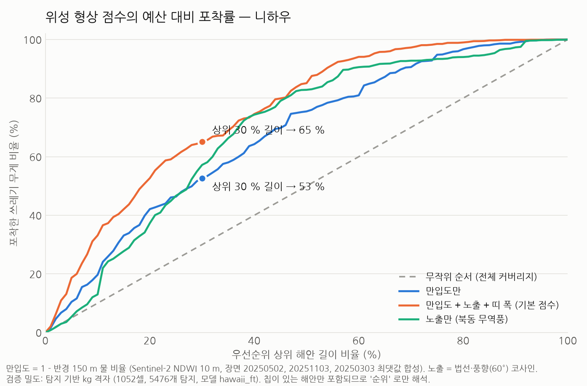
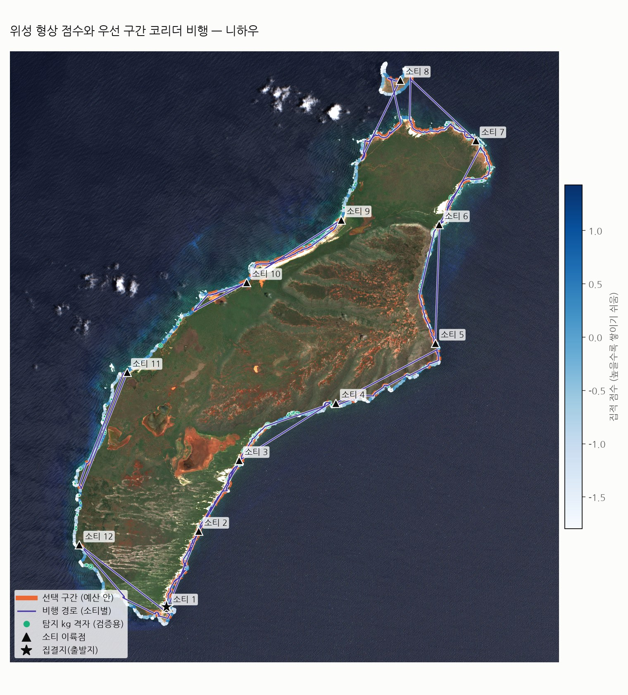

# 위성 형상 점수로 드론 정밀촬영 구간 고르기 — 니하우 적용 (2026-10-01)

> 위성 픽셀(10 m)로는 쓰레기가 안 보인다. 대신 **해안선 형상**(만입도·풍향 노출·해빈 띠 폭)을 재서 "쌓이기 쉬운 구간" 을 점수화하고,
> 드론 정밀 촬영은 점수 상위 구간에만 쓴다. 코드: `litter3d/priority.py`, `scripts/18_priority_flight.py`, `tools/fetch_s2_aws.py`.

## 1. 결과 (니하우, 해안 98.8 km, 해안 길이 상위 30 % 선택)



| 점수 | 상위 10 % 길이 | 20 % | **30 %** | 50 % |
|---|---|---|---|---|
| 만입도만 | 20 % | 42 % | **53 %** | 76 % |
| **만입도 + 노출 + 띠 폭 (기본)** | 33 % | 53 % | **65 %** | 85 % |
| 노출만 (북동 무역풍 60°) | 13 % | 37 % | **57 %** | 83 % |
| 무작위 (전체 커버리지) | 10 % | 20 % | 30 % | 50 % |

- 포착률 = 상위 X % 해안 길이 안에 들어간 **탐지 무게(kg)** 비율. 검증 밀도는 coastal 브랜치 `hawaii.py` 가 니하우 칩 553장에서 낸 탐지 격자(10 m, 1,052셀, 5,476개, 13.7 t) 이다. 칩이 있는 해안만 포함되므로 "순위가 맞는다" 까지만 해석한다.
- 만입도 3분위별 밀도: 곶 40 → 직선 128 → **만 244 kg/km** (6배). 노출: 해안 평균 0.00, 탐지 kg 가중 평균 **+0.39** (바람맞이 해안에 몰림, Moy et al. 2018 과 같은 방향).
- 200 m 구간 148개(29.6 km) 선택 → 탐지 무게 **67 %** 포착.



| 항목 | 값 |
|---|---|
| 비행 | 고도 60 m(Mini 5 Pro 약 1.05 cm/px, 촬영폭 86 m), 1패스, 5 m/s, 소티당 25분 (가정값) |
| 이륙 | 이동식: 소티마다 첫 구간 근처에서 이륙 (섬 둘레 92 km 가 배터리 왕복 거리보다 길어 고정 출발지로는 대부분 도달 불가) |
| 소티 | **12회**, 총 132 km · 273분(약 4.6시간). 소티별 웨이포인트 Litchi CSV + DJI WPML KMZ |

## 2. 방법

```
Sentinel-2 L2A (AWS 공개 COG, 맑은 장면 3개: 2025-05-02 · 11-03 · 03-03)
 → NDWI 픽셀별 최댓값 합성 (SCL 로 구름·그림자 제외, 모든 장면이 구름이면 물)
 → 육지 마스크 (0.5 km² 이상 덩어리, 섬 안 호수 채움) → 둘레 벡터화 → 10 m 표본점 + 바깥 법선
 → 특징: 만입도 = 1 − 반경 150 m 물 비율 · 노출 = cos(법선 방위 − 풍향) · 띠 폭 = 물·식생 아닌 안쪽 길이(NDVI)
 → 점수 = z(만입도) + 0.5 z(노출) + 0.5 z(log 띠 폭), 해안선 방향 100 m 이동평균
 → 200 m 구간 → 점수 순으로 길이 예산(30 %) 채움
 → 구간마다 해안선을 안쪽으로 swath×0.3 offset 한 코리더 → 웨이포인트(Douglas-Peucker 4 m)
 → 구간 순서 = 최근접 이웃(양방향) + 2-opt, 배터리 넘으면 복귀·새 소티
```

재현:
```bash
pip install rasterio shapely pyproj scipy matplotlib
python tools/fetch_s2_aws.py --tile 4QCK --list 2025 --check --bounds 368000 2407000 395000 2437000   # 장면 고르기
python tools/fetch_s2_aws.py --tile 4QCK --bounds 368000 2407000 395000 2437000 \
    --scenes S2B_4QCK_20250502_0_L2A,S2C_4QCK_20251103_0_L2A,S2B_4QCK_20250303_0_L2A --out s2 --prefix niihau
python scripts/18_priority_flight.py --s2-dir s2 --scenes 20250502,20251103,20250303 --tci-scene 20250502 \
    --density-grid hawaii_niihau_ft_summary.json --depot="-160.2024,21.7869" --wind-from 60 --budget-frac 0.3 --out outputs/niihau
```
`hawaii_niihau_ft_summary.json` 은 dohun415/aerodrone_hackathon `feature/coastal-litter-pipeline` 의 `docs/figures/` 에 있다.
밀도 없이도(`--density-grid` 생략) 점수·구간·경로는 만들어진다. 다른 섬은 `--tile`, `--bounds`, `--depot`, `--wind-from` 만 바꾼다.
한국 서해는 풍향을 조사 직전 몇 달 기준으로 (여름 남풍 계열, 겨울 북서풍) 넣는다.

출력(`outputs/<site>/`): `예산대비포착률.png`, `우선구간_비행경로_지도.png`, `segments.csv`(구간별 점수·특징·선택·소티), `우선구간_경로.geojson`,
`sortie_NN_litchi.csv`, `sortie_NN_dji.kmz`, `summary.json`. 예시는 `docs/examples/niihau/`.

## 3. 한계와 주의

- 점수 가중치·고도·촬영폭·속도·배터리·코리더 offset 은 **가정값**이다. 만입도 창은 정사각 근사다.
- 검증 밀도는 **라벨이 아니라 탐지**(미세조정 모델, 재현율 0.58)이고, 칩이 잘린 해안만 들어 있다. 공개 라벨 원본(Zenodo 8381113)으로 다시 재면 된다 (`--density-csv x,y,w`).
- 해안선 10 m 격자의 계단 때문에 둘레 길이가 실제보다 길게 나온다 (니하우 91.6 km). 비율 지표에는 영향이 작다.
- 구간 사이 이동과 복귀는 직선이다. 실제 비행 전 고도·장애물·가시권·허가를 확인해야 한다. WPML KMZ 는 실기체 임포트를 확인하지 못했다 (Mini 5 Pro + RC2 는 포럼에 막힌 사례 있음). Litchi CSV 는 99 웨이포인트 제한을 넘는 소티는 나눠야 한다.
- 섬 안 호수를 육지로 채우므로 호숫가는 해안으로 잡히지 않는다. Lehua 같은 부속 섬은 별도 둘레로 포함된다.

## 4. 발표 문장

"위성으로는 쓰레기가 안 보인다. 그래서 위성으로는 해안 형상을 재고, 형상 점수 상위 30 % 구간만 정밀 촬영해도 니하우 탐지 무게의 65 % 를 잡는다.
그 구간을 코리더 경로·소티로 바꿔 Litchi·DJI 파일로 내보낸다. 어디를 날지는 위성이, 무엇이 얼마나 무거운지는 드론 3D 가 정한다."
