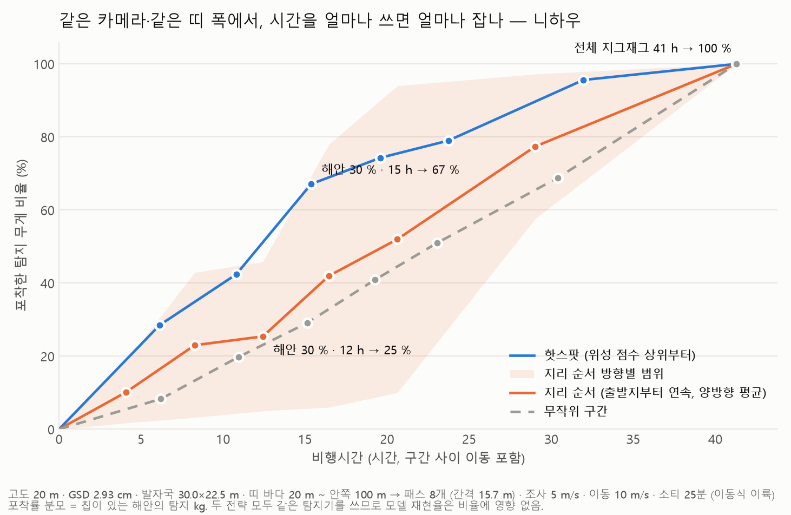
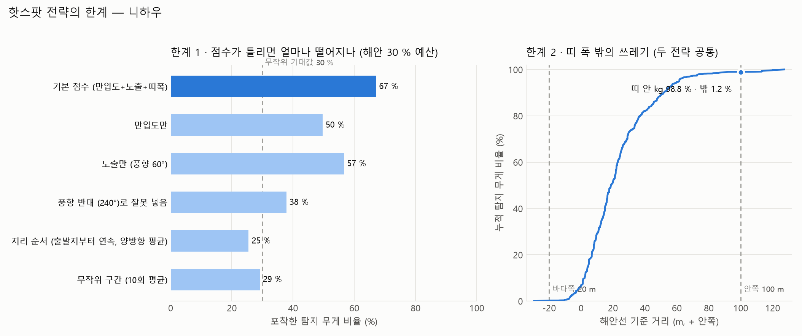
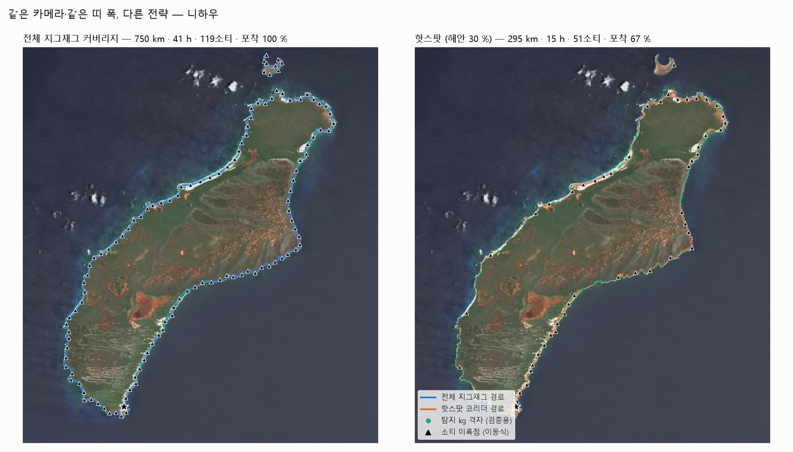

# 핫스팟만 나는 드론 경로 vs 전체 지그재그 탐지 — 정량 비교 모델 (니하우, 2026-10-02)

> 질문: 위성 형상 점수로 고른 "핫스팟 구간만" 최적화 경로로 나는 것이, 해안 인접 영역 전체를 지그재그로 훑는 기존 탐지 방식보다
> **얼마나 유리하고(비행시간·소티·프레임), 무엇을 얼마나 놓치는가(설계상 미포착·점수 오류·띠 폭 밖·미발견 해안)**.
> 코드: `litter3d/strategy.py`, `scripts/19_strategy_compare.py`, 테스트 `tests/test_strategy.py`. 표·json: `docs/examples/niihau_strategy/`.

## 0. 한 줄 결론

같은 카메라(고도 20 m, GSD 2.9 cm)·같은 띠 폭(해안선 바다쪽 20 m ~ 안쪽 100 m, 평행선 8개)이면
**핫스팟 30 % 는 전체 지그재그의 37 % 시간(15.4 h vs 41.3 h)·35 % 프레임으로 탐지 무게의 67 % 를 잡는다.**
위성 정보 없이 같은 시간을 쓰면(출발지에서 해안 따라 연속, 양방향 평균) 25 %, 무작위 구간이면 29 % 다.
대가는 설계상 못 보는 33 % 와, 점수가 틀렸을 때의 하락(풍향을 반대로 넣으면 67 → 38 %)이다.

## 1. 비교 조건 (전략 말고는 전부 같다)

| 항목 | 값 | 출처 |
|---|---|---|
| 해안선 | Sentinel-2 NDWI 10 m 표본점 98.8 km (둘레 2개: 니하우 91.6 + 레후아 7.2) | `priority.py` |
| 카메라·고도 | 1024×768, HFOV 73.7°, **고도 20 m → GSD 2.93 cm, 발자국 30.0×22.5 m** | 기존 시뮬 `sim_ortho.py` Camera 와 동일 |
| 띠 폭 | 바다쪽 20 m ~ 안쪽 100 m (탐지 kg 의 98.8 % 가 이 안. kg 가중 거리 5/50/95/99 % = −2/19/62/95 m) | 탐지 격자에서 측정 |
| 패스 | 횡방향 22.5 m × (1−0.3 겹침) = 15.7 m 간격 평행선 **8개** (sim_ortho `Planner.coverage` 와 같은 식) | 계산 |
| 속도·배터리 | 조사 5 m/s, 구간 사이 이동 10 m/s, 소티 25분, 이동식 이륙(소티마다 첫 구간 근처) | 가정값 |
| 프레임 | 1 프레임/초 (sim_ortho dt), 탐지 CPU 0.22 s/프레임, 0.4 MB/프레임 | 기존 시뮬 측정값 |
| 검증 밀도 | 하와이 Winans 2023 칩 553장의 탐지 kg 격자 1,052셀·5,476개 (모델 hawaii_ft) | coastal 브랜치 `hawaii.py` |

평행선은 shapely `offset_curve` 로 만든다. 표본점마다 법선을 곱해 미는 방식은 10 m 격자 해안선의 들쭉날쭉한 법선 때문에
100 m 안쪽에서 길이가 둘레의 2.2배(201 km)로 부풀었고, offset_curve 는 80 km(볼록한 섬이라 안쪽이 짧다)를 준다.

전략
- **전체 지그재그 (기존)**: 둘레 전체를 8개 평행선으로 연속 커버. 소티는 배터리에 맞춰 해안을 따라 자른다.
- **핫스팟**: 위성 점수(만입도 + 0.5 노출 + 0.5 띠 폭) 상위 X % 길이의 200 m 구간만, 같은 8개 평행선으로. 인접 구간은 이어 날고 떨어진 구간 사이는 이동 속도로 건너뜀.
- **핫스팟 + 간격 메움**: 선택 구간 사이 200 m 이하 틈은 그냥 조사하며 지나감 (이동·선회 대신 조사 길이가 늘어남).
- **지리 순서**: 같은 X % 길이를 출발지(섬 남단)에서 해안을 따라 연속으로. 방향에 따라 결과가 크게 달라(동해안 쪽으로 돌면 46 %, 반대면 5 %) **양방향 평균**을 쓴다.
- **무작위 구간**: 같은 X % 길이를 무작위 200 m 구간으로, 10회 평균.

## 2. 결과 — 시간을 얼마나 쓰면 얼마나 잡나



| 전략 | 해안 예산 | 조사 km | 이동 km | 비행 h | 소티 | 프레임 | 탐지 CPU h | **포착 kg %** | 포착 %/h |
|---|---|---|---|---|---|---|---|---|---|
| 전체 지그재그 | 100 % | 736 | 14 | **41.3** | 119 | 147,266 | 9.0 | **100** | 2.4 |
| 핫스팟 | 70 % | 562 | 26 | 31.9 | 104 | 112,409 | 6.9 | 96 | 3.0 |
| 핫스팟 | 50 % | 412 | 31 | 23.7 | 81 | 82,332 | 5.0 | 79 | 3.3 |
| **핫스팟** | **30 %** | 258 | 37 | **15.4** | 51 | 51,640 | 3.2 | **67** | 4.4 |
| 핫스팟 + 간격 메움 | 30 % | 287 | 27 | 16.7 | 53 | 57,367 | 3.5 | 75 | 4.5 |
| 지리 순서 (양방향 평균) | 30 % | 221 | 4 | 12.4 | 36 | 44,285 | 2.7 | 25 (5~46) | 2.0 |
| 무작위 구간 (평균) | 30 % | 231 | 82 | 15.1 | 47 | 46,225 | 2.8 | 29 | 1.9 |
| 핫스팟 | 10 % | 93 | 35 | 6.1 | 20 | 18,536 | 1.1 | 28 | 4.7 |

전체 표(10·20·40 % 포함, 정·역방향 따로)는 `docs/examples/niihau_strategy/비교표.md`.

**정량적 이점 (핫스팟 30 % 기준)**
- 비행시간 41.3 → 15.4 h (**−63 %**), 소티 119 → 51, 프레임·탐지 CPU·데이터 147k → 52k (**−65 %**, 9.0 → 3.2 CPU h, 58 → 20 GB). 뒤따르는 3D 재구성(COLMAP)도 같은 비율로 준다.
- 같은 67 % 를 잡으려면 지리 순서는 약 26 h, 무작위는 약 30 h 가 든다 (곡선 보간). 위성 점수가 **10~14 h 를 아낀다**.
- 시간당 포착 효율 4.4 %/h 로 전체 지그재그(2.4 %/h)의 1.8배. 예산 10 % 에서는 4.7 %/h.
- 90 % 이상을 원하면 핫스팟도 60~70 % 길이를 날아야 한다 (70 % → 96 %, 31.9 h). 이때 절감은 23 % 로 줄어든다 → **핫스팟 전략은 "빠르게 대부분" 에 강하고 "전수" 에는 이점이 작다.**

## 3. 한계 — 숫자로



| 한계 | 수치 (니하우) | 어떻게 줄이나 |
|---|---|---|
| **설계상 미포착** | 30 % 예산에서 탐지 무게 **33 %** 는 아예 안 본다 (50 % → 21 %, 70 % → 4 %) | 예산을 늘리거나, 간격 메움(30 % 예산 +1.3 h 로 67 → 75 %) |
| **점수 오류 민감도** | 만입도만 50 %, 노출만 57 %, **풍향을 반대로 넣으면 38 %** (무작위 29 % 에 근접). 문갑도에서도 7월 라벨에 겨울 풍향(315°)을 넣으면 노출 점수가 무작위보다 못했다 | 조사 직전 몇 달 풍향을 쓰고, 만입도(계절 무관)를 주 가중치로 |
| **이동·분절 오버헤드** | 같은 30 % 길이를 날아도 핫스팟은 67개 분리 구간 → 소티 51개·이동 37 km, 지리 순서(연속)는 36소티·4 km. **같은 길이에 시간 +24 %** | 간격 메움, 구간 길이 200 → 400 m, 이륙점을 묶는 지상 이동 계획 |
| **지상 이동** | 이동식 이륙점 사이 직선 거리 71 km (전체 지그재그 80 km). 차·배로 섬을 한 바퀴 도는 운용이 전제 | 고정 출발지로는 대부분 구간이 배터리 왕복 불가 (이전 분석) |
| **띠 폭 밖** | 띠(−20~+100 m) 밖 탐지 kg **1.2 %** — 두 전략 공통. 띠를 60 m 로 줄이면 5 % 를 잃는다 | 띠 폭은 탐지 거리 분포로 정한다 |
| **미발견 해안** | 선택 안 된 70 % 해안은 **관측 자체가 없어** 새 핫스팟이 생겨도 모른다 | 주기적 전체 커버리지 혼합: 4회에 1번 전수 → 평균 21.8 h/회 (매번 전수 41.3, 핫스팟만 15.4) |
| **검증 편향** | 밀도가 라벨이 아니라 탐지(재현율 0.58)이고, 칩이 있는 해안만 포함 → "순위가 맞는다" 까지. 포착률 분모도 칩 해안의 kg | Zenodo 원본 라벨(chips.csv)로 재검증 예정 |
| **가정값** | 고도·속도·배터리·겹침·이동 속도·점수 가중치. 고도 60 m(GSD 8.8 cm, 패스 3개)로 바꾸면 전체 17.4 h vs 핫스팟 30 % 8.0 h(46 %)로 비율은 비슷하나, 핫스팟의 이동 비율이 12 → 44 % 로 커진다 (`비교표_고도60m.md`) | 현재 탐지 모델은 2~4 cm/px 학습이라 20 m 가 기준 |

## 4. 지도



왼쪽: 전체 지그재그 750 km·41 h·119소티. 오른쪽: 핫스팟 30 % 295 km·15 h·51소티·포착 67 %. ▲ 소티 이륙점(이동식), 초록 점 = 탐지 kg 격자.

## 5. 판단 규칙 (이 모델을 어떻게 쓰나)

1. 목표가 **"제한된 시간에 무게를 최대한"** (수거 우선순위, 정기 모니터링)이면 핫스팟 30~50 %: 시간 37~57 % 로 무게 67~79 %.
2. 목표가 **"전수 조사"** (기준선 구축, 변화 탐지)면 전체 지그재그. 핫스팟 70 % 로도 96 % 지만 절감은 23 % 뿐.
3. 풍향을 모르거나 계절이 바뀌는 해안(서해)은 **만입도만** 으로 고르는 편이 안전하다 (니하우 50 %, 문갑도 라벨 62 %).
4. 운용은 **N회에 1번 전수 + 나머지 핫스팟** 으로 섞어 미발견 위험을 관리한다. N=4 면 평균 시간은 전수의 53 %.

재현:
```bash
python scripts/19_strategy_compare.py --s2-dir input/s2_niihau --scenes 20250502,20251103,20250303 --tci-scene 20250502 \
    --density-grid input/s2_niihau/hawaii_niihau_ft_summary.json --depot="-160.2024,21.7869" --wind-from 60 \
    --alt 20 --sea-m 20 --inland-m 100 --out outputs/strategy_niihau          # 약 1분
python scripts/19_strategy_compare.py ... --alt 60 --out outputs/strategy_niihau_alt60   # 고도 민감도
python -m pytest tests/test_strategy.py -q
```
다른 섬·문갑도는 `--s2-dir/--prefix/--scenes/--depot/--wind-from` 과 `--density-csv lon,lat,w` 만 바꾼다.
