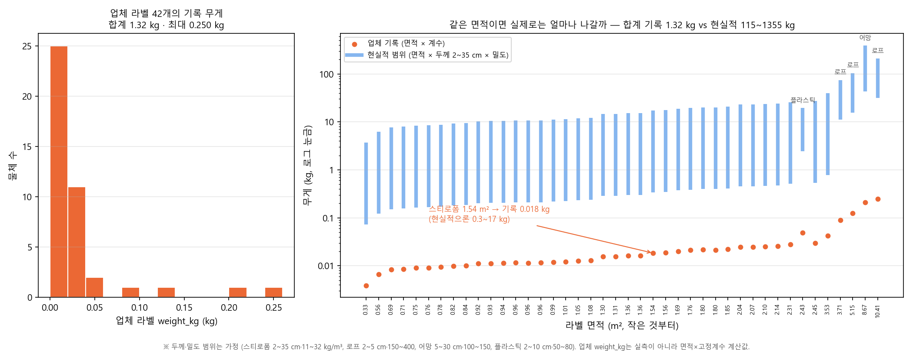
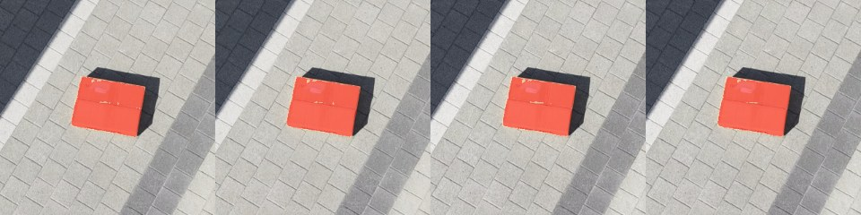
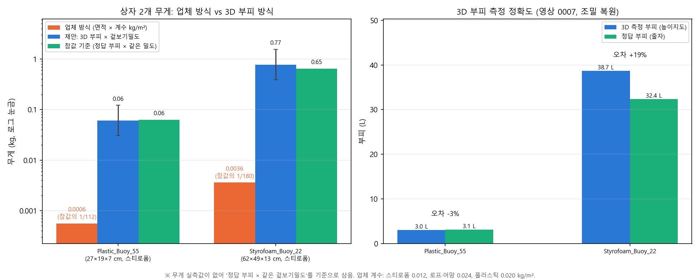
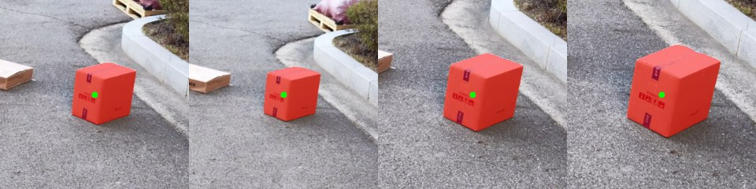

# 해안쓰레기 드론 파이프라인 — 무엇을 어떻게 했나 (2026-10-01 기준)

> 한 줄 요약: **"비행은 사람, 나머지는 AI"** — 드론 영상 한 개로 쓰레기를 찾고, 3D로 부피를 재고, 재질별 무게와 수거 작업카드까지 자동으로 만든다.
> 업체의 기존 방식(박스 면적 × 고정 계수 = 무게)이 실제보다 **수십~수백 배 작게** 나오는 문제를 3D 부피로 고친다.

코드는 모두 `litter/` 패키지, 실행은 `.venv\Scripts\python.exe -m litter.<모듈>`. 그림·수치는 `docs/figures/`.

---

## 1. 문제 정의 — 업체 방식은 왜 틀리나

- 업체 라벨(문갑도, 42개)의 `weight_kg` = **라벨 사각형 면적 × 재질별 고정 계수** (스티로폼 0.012, 로프·어망 0.024, 플라스틱 0.020 kg/m²). 실측이 아니다.
- 예: 1.54 m² 스티로폼 더미가 **0.018 kg**으로 기록됨. 같은 면적에 현실적인 두께(2~35 cm)와 밀도를 주면 0.3~17 kg.
- 42개 합계: 업체 기록 **1.32 kg** ↔ 현실적 범위 **115~1,355 kg**.
- 업체 데이터는 RGB 정사영상(3 cm/px)뿐이라 **높이(DSM) 정보가 없음** → 업체 데이터만으로는 부피를 직접 잴 수 없다. 그래서 우리는 **영상에서 3D를 만들어 높이를 직접 잰다.**



---

## 2. 전체 파이프라인

```
드론 영상(.MP4) + 비행기록(.SRT: GPS·고도)
   │
   ├─ ① 탐지        seg.py         YOLO 타일 추론 (AI Hub 해안쓰레기 / UAVVaste 학습 모델)
   ├─ ② 3D 복원     orbit3d.py     프레임 추출 → pycolmap SfM → SRT 고도·GPS로 실제 축척
   │                (조밀)         COLMAP GPU patch-match → 점 수백만 개
   ├─ ③ 위치        orbit_map.py   3D 카메라 방향으로 탐지 위치 계산 → GPS 맞춤 → 지도 핀
   │                mosaic.py      3D로 정사영상(모자이크) 만들고 물체 표시
   ├─ ④ 부피        objvol.py      SAM 2 마스크 + 여러 프레임 투표로 물체 점만 골라 높이지도 부피
   │                volume.py      바닥면 RANSAC, 축척 자동(고도 / GPS 경로)
   ├─ ⑤ 무게        weight.py      부피 × 재질별 겉보기밀도 (+ 구간, 젖음 계수)
   ├─ ⑥ 수거계획    plan.py        인력(1인/2인/장비)·정거장·마대·트럭·경로
   └─ ⑦ 작업카드    report.py      HTML 작업카드 + 지도
        ↑ ④→⑦ 연결: fromvideo.py  (오늘 추가)

실시간 운용(자동비행)은 실기체 SDK 미지원 → sim_ortho.py 가상비행 시뮬로 대체 (오늘 추가)
```

### 모듈 표

| 모듈 | 하는 일 | 상태 |
|---|---|---|
| `aihub.py` | AI Hub 해안 오염물질 데이터 추출·COCO 변환·거리별(2~4 cm/px) 학습셋 생성 | 완료 |
| `seg.py` | YOLO 타일 학습/추론/평가, 한글 경로 안전 입출력 | 완료 |
| `ortho.py` | 업체 정사영상 + 라벨 → 평가용 칩 | 완료 |
| `orbit3d.py` | 선회 영상 → 3D(SfM) → viewer.html, `--srt`로 실제 크기, `--exhaustive`(왕복 비행용) | 완료 |
| `volume.py` | 바닥면·축척·높이지도/볼록껍질 부피. **수평 이동 10 m 이상이면 GPS 경로로 축척** (SRT 고도 오차 대응) | 오늘 수정 |
| `orbit_map.py` | 탐지 → 3D 광선 → 지도 좌표 → `map.html`, `objects.csv` | 완료 |
| `mosaic.py` | 3D 기반 정사영상 + 물체 표시 | 완료 |
| `objvol.py` | SAM 2 마스크 투표로 물체 점 분리 → 부피. 조밀 점(`--ply`) 지원, **높이 중앙값 기준**으로 모서리 잡음 제거 | 오늘 수정 |
| `weight.py` | 무게 추정(물리+학습+구간), 23 kg 1인 한계 경고 | 완료 |
| `plan.py`, `report.py` | 수거계획·작업카드 | 완료 (report: 마스크 썸네일 지원 추가) |
| `config.py` | 재질표: 겉보기밀도 + **두께 범위·마대 압축비·젖음 계수·업체 계수표** 추가 (값은 가정, 주석 표기) | 오늘 확장 |
| **`fromvideo.py`** | **영상 결과(objvol.json) → 무게 → 수거계획 → 작업카드 한 번에** + 업체 방식 비교 그림 | **오늘 신규** |
| **`sim_ortho.py`** | **문갑도 정사영상 위 가상비행 시뮬** (커버리지 경로·실시간 탐지·지도화·능동 재방문) | **오늘 신규** |
| `live.py` | 휴대폰/태블릿 미러링 실시간 탐지 (실시간은 접어서 참고용) | 보류 |
| `video_map.py` | SRT만으로 지도 (방향 정보 없어 부정확 → orbit_map 권장) | 참고용 |
| `synth.py` | 합성 해변 데이터 (파이프라인 검증용) | 완료 |

---

## 3. 결과

### 3-1. 영상 0007 — 송도 선회 시험 (고도 ~7 m, 크기 아는 상자 2개)

**3D 복원**: 100/100 프레임 등록, 재투영 오차 0.42 px, 축척 편차 2.8 %, 3D↔GPS 잔차 1.16 m. 지도 핀이 두 상자 위치와 정확히 일치.

**부피** (조밀 복원 243만 점 + SAM 2 마스크 투표 + 지역 바닥 평면 + 높이지도; `objvol.py` v2, 2026-10-01 밤 수정):

| 상자 | 정답 | 3D 측정 | 부피 | 오차 |
|---|---|---|---|---|
| 작은 상자 | 23×17×8 cm, 3.1 L | 27×19×11.5 cm | **3.7 L** | **+19 %** |
| 큰 상자 | 60×45×12 cm, 32.4 L | 62×49×13.5 cm | **38.8 L** | **+20 %** |

- 발전 과정: 반경 방식 15 L / 26~55 L → 희소 점+SAM 1.8 L / 28~31 L → 조밀+SAM+중앙값 3.0 L / 38.7 L → **v2(평면 바닥·바닥점 제거·뒤집힌 카메라 제외) 3.7 L / 38.8 L**
- v2 이전 작은 상자 −3 %는 바닥 잡음과 윗면 점이 섞여 우연히 맞은 값. 점구름 자체가 윗면을 11.5 cm로 복원(정답 8) → 7 m 고도에서 무늬 없는 상자 윗면이 1.5~3.5 cm 높게 잡히는 편향. 발자국도 SAM 마스크가 그림자를 포함해 +13~28 %.
- 수치 json: `figures/0007_objvol_v2.json` (v1: `0007_objvol_dense.json`)



**업체 방식 vs 우리 방식 (무게)**:

| 상자 | 업체 방식 (면적×계수) | 우리 (3D 부피×밀도) | 기준값* |
|---|---|---|---|
| 작은 상자 | 0.0006 kg (**기준의 1/112**) | 0.061 kg (0.03~0.12) | 0.063 kg |
| 큰 상자 | 0.0036 kg (**기준의 1/180**) | 0.774 kg (0.39~1.55) | 0.648 kg |

\* 무게 실측이 아직 없어 "정답 부피 × 같은 겉보기밀도"를 기준값으로 사용. **저울 실측으로 교체 예정.**



**작업카드**: `figures/14_0007_작업카드.html` — 정거장 1곳, 총 0.83 kg(상한 1.67), 1인×2, 마대 1개, 1톤 트럭 1, 경로 20 m.

```bash
# 영상 → 작업카드 (GPU 불필요, 수 초)
.venv\Scripts\python.exe -m litter.fromvideo run --objvol runs/orbit/0007/objvol_dense/objvol.json \
  --objects runs/map/0007_sfm/objects.csv \
  --material "Plastic_Buoy_55:Styrofoam,Styrofoam_Buoy_22:Styrofoam" --out runs/plan/0007
# 업체 방식 비교 그림
.venv\Scripts\python.exe -m litter.fromvideo compare --objvol runs/orbit/0007/objvol_dense/objvol.json \
  --material "Plastic_Buoy_55:Styrofoam,Styrofoam_Buoy_22:Styrofoam" \
  --labels data/company/MGD_labels.json --out runs/plan/compare
```

### 3-2. 영상 0010 — 골목 왕복 비행 (실제 높이 ~2 m, 25 m 왕복, 상자 여러 개)

- 순차 매칭은 왕복 때문에 3조각 → **전수 매칭(`--exhaustive`)으로 100/100 한 덩어리** (점 91,282)
- SRT 고도(3.7 m)가 실제와 안 맞음(이륙 지점이 높았음) → **GPS 경로로 축척** 맞추도록 `volume.py` 수정: 3D↔GPS 잔차 **8.07 m → 0.51 m**
- 쓰레기 후보 16개 + 장애물 9개(사람·오토바이·차량) 지도화
- 조밀 복원(COLMAP, 204만 점) → 처음엔 **높이 2 cm로 실패**. 점구름을 직접 열어 보니 39 cm 상자 점은 있었고(높이 p50/p90 = 31/44 cm), 원인은 부피 코드: ① 경사 단방향 촬영이라 상자 뒤 바닥점이 마스크 안에 들어와 투표를 통과 ② 반환점 제자리 회전 구간 카메라 16장 포즈가 뒤집혔는데 "가장 수직"으로 뽑힘 ③ 골목 경사(5~11 %)를 바닥 값 하나로 처리
- **`objvol.py` v2 수정**: 링 점으로 지역 바닥 평면(RANSAC) → 점 높이 = 평면 기준, 물체 점 = 투표 ∩ 높이>3 cm, 윗면 높이 = 히스토그램 상단 봉우리, 카메라 높이<0.3 m·기울기>85° 프레임 제외, 물체 중심 재추정(0.79 m 이동)

| 상자 | 정답 | v1 | **v2** |
|---|---|---|---|
| 키 큰 상자 (`Styrofoam_Buoy_3_2`) | 32×42×39 cm, 52.4 L | 112×45×2 cm, 7 L (실패) | **49×37×38 cm, 47.2 L (−10 %)** |
| 흰 송장 상자 (`Styrofoam_Buoy_4`) | 미측정 | 72×57×2.5 cm | 60×50×12.5 cm, 32.8 L |



- 경사 단방향 촬영이라 발자국 모양은 왜곡(49×37 vs 32×42)되지만 높이·부피는 맞음 → 선회 또는 수직 1장이 있어야 안정적
- 주거 골목이라 사람·차량이 찍혀 있어 이미지는 저장소에 올리지 않음 (`runs/map/0010/`)

**정리: 크기 아는 상자 3개(고도 2 m 경사 / 7 m 선회)에서 부피 오차 −10 ~ +20 %.** 업체 방식은 같은 상자에서 1/100~1/200.

### 3-2-1. 영상 0015 — 야간 10분 비행, 상자 ~28개 (2026-10-01 20:54 촬영)

- 야간(ISO 6400~11080, 드론 조명), 4K 60 fps 10분, 고도 0.5~3.5 m, 531 m 경로
- AI Hub 학습 모델: 상자 **4개**만 탐지 (종이상자 클래스 없음 + 야간)
- **개방형 탐지(YOLO-World)에 "cardboard box" 글로 지정 → 상자 30개 탐지** (신뢰도 0.49~0.95, 오탐 1), 그중 고유 상자 약 26~28개. `video_map.py`에 `--classes`, `--alt_fix`(SRT 고도가 음수로 흐름), `--merge_m` 옵션 추가
- → "현장에서 새 쓰레기 종류가 나와도 재학습 없이 이름만 추가"
- 결과: `figures/16_0015_야간_상자30개_지도.png`, `figures/0015_objects.csv` (`runs/map/0015_world2/`)
- **빠른 3D 검증**: 상자 #24 구간 10초(60프레임) → 3D 뼈대 60/60 등록(야간에도 성공) → 조밀 복원 **3분 24초**(1200 px·소스 8·반복 3·cache 8 GB; 기존 설정 ~45분) 323,013점. **부피는 실패**: 옆 연석 때문에 바닥 평면 30° 틀어짐, 단방향 경사 통과 촬영. #19(어두운 아스팔트)는 37/60 등록으로 점 부족. → 부피엔 선회 촬영이 필요(촬영 가이드 근거)
- 0015 SRT 고도가 실제의 1/5로 기록돼 있어 `--alt_fix 2.0`(지도), `--min-track 4`(3D 축척을 GPS 경로로) 필요

**상자 30개 전부 구간별 3D·부피 일괄 처리** (`batch3d.py`, 25구간, 총 ~1시간 40분; `figures/20_0015_상자30개_3D위치_부피.png`, `0015_objects3d.csv`, `0015_batch3d_summary.json`)

| 단계 | 성공 | 평균 시간 |
|---|---|---|
| 3D 뼈대(SfM, 40~60장) | **25/25** | 3.9분 (CPU, 2개 동시) |
| 조밀 복원(빠른 설정) | **25/25** | 2.7분 |
| 3D 위치 | 26/30 상자 | 0.5분 |
| 부피 | **11/30** (신뢰 높음 4·중간 1·낮음 6) | 1분 |

상자 정답(전부 같은 규격 **42×32×39 cm = 52.4 L**)과 비교:

| 상자 | 측정 (cm) | 부피 | 오차 | 높이 오차 | 신뢰 |
|---|---|---|---|---|---|
| #9 | 47×40×42 | 71 L | +35 % | +2 cm | 높음 |
| #21 | 43×39×34 | 44 L | −17 % | −4 cm | 높음 |
| #11 | 44×41×42 | 64 L | +22 % | +4 cm | 낮음(뷰 4) |
| #15 | 33×32×32 | 32 L | −39 % | −6 cm | 중간 |
| #19 | 79×46×48 | 91 L | +73 % | +10 cm | 높음 |
| #6, #24, #4, #10, #12, #14 | — | — | −100 ~ +440 % | — | 틀림 (납작 탐지·연석·점 부족) |

- **높이는 4개에서 ±6 cm 안**(정답 39)이지만 **발자국(가로·세로)이 흔들림** → 단방향 경사 통과·야간이라 윗면 가장자리 점이 부족. 신뢰 플래그 "높음"도 #6·#19처럼 틀릴 수 있어 플래그 기준 보완 필요.
- 실패 19건 원인: SAM 마스크 없음 7(어두운 보도블록 #26~30), 바닥 평면 틀어짐 4(연석·경사), 점 부족 3, 중복 탐지 쌍 흡수 3, 정합 오류 2.
- **결론**: 야간 통과 비행으로도 탐지·지도·3D 뼈대·조밀까지는 전부 되지만, 부피는 **선회 촬영(0007·0010: −10~+20 %)이 필요**. 이 실패 분류가 촬영 가이드의 근거.

```bash
.venv\Scripts\python.exe -m litter.video_map --video ../DJI_20261001205404_0015_D.MP4 --srt ../DJI_20261001205404_0015_D.SRT \
  --out runs/map/0015_world2 --weights yolov8s-worldv2.pt --classes "cardboard box,plastic bag,bottle" \
  --every 0.5 --alt_fix 2.0 --merge_m 3.5 --pitch -45 --conf 0.35
```

### 3-3. 쓰레기 탐지

| 모델 | 학습 | 결과 |
|---|---|---|
| UAVVaste (`runs/seg/uavvaste_det_s`) | 공개 데이터 772장 (도시) | 자체 시험 AP50 0.77 / 문갑도 재현율 0.28 (현장 차이) |
| **AI Hub 거리별** (`runs/seg/aihub_gsd_det_s`) | 해안쓰레기 1.2만 장을 2~4 cm/px로 축소 | **12 에폭 중 5**, 검증 mAP50 0.31 / **문갑도 재현율 0.72 (스티로폼 0.81)** |

> ⚠️ 이전 문서의 "문갑도 재현율 0.28"은 UAVVaste 모델 수치. AI Hub 모델은 10-01 밤 교차평가에서 처음 측정 → **0.72**.

**현장 일반화 교차평가** (`litter/crosseval.py`, 클래스 무시, IoU 0.3, conf 0.25; `figures/cross_eval.json`, `figures/19_튀니지_교차평가.jpg`)

| 데이터 | UAVVaste 모델 | **AI Hub 모델** | YOLO-World(글로 클래스 지정) |
|---|---|---|---|
| 문갑도 업체 칩 48장 (한국 해안 정사영상 3 cm/px, 정답 47) | 0.28 | **0.72** | 0.00 |
| 튀니지 해변 드론 179장 (근접 촬영, 정답 360) | **0.33** | 0.14 | 0.02 |
| 하와이 항공 정사영상 420칩 (2 cm/px, 정답 3,195, ×2 확대 추론) | — | **0.24 (conf 0.1) ~ 0.36 (conf 0.05)** → 10분 미세조정 후 **0.58~0.79** | 0.01 |

- AI Hub 모델 = **국내 해안·정사영상 스케일 전용으로 강함**(부표·스티로폼), 하와이에서도 재학습 없이 0.24~0.36. UAVVaste = 낯선 근접 촬영에서 범용 백업(금속 0.71·골판지 0.61).
- **YOLO-World는 범용 쓰레기 탐지 대체가 아님** — 형태가 뚜렷한 특정 물체(야간 종이상자 30개)에 "이름만 추가"하는 용도. 항공 시점 작은 물체는 거의 못 봄.
- 다음: Colab 30 에폭 학습(`C:\work\colab\` 패키지), 하와이 칩 미세조정.

### 3-3-1. 해외 해안 데이터 적용 — 하와이 (`litter/hawaii.py`)

"학교 주변에서 검증한 파이프라인을 실제 해안 데이터에 그대로" — 하와이 8개 섬 항공 정사영상 칩 1,588장(2 cm/px, Zenodo 8381113, CC-BY)의 `.aux.xml` 지오참조(NAD83 UTM 4N/5N)를 읽어 **탐지 → 위경도 → 2D 무게 구간 → 수거계획 → 작업카드**.

**하와이 학습 칩 1,167장으로 10분 미세조정** (`hawaii ft`, 단일 클래스, 8 에폭 3.2분, `runs/seg/hawaii_ft/weights/best.pt`):

| 모델 | 재현율 (정밀도 ≈0.56 기준) | AP50 |
|---|---|---|
| YOLO-World | 0.01 | 0.01 |
| AI Hub 모델, 재학습 없음 (×2 확대) | 0.24 | 0.23 |
| **AI Hub → 하와이 미세조정** (×1, conf 0.3) | **0.58** (conf 0.05이면 0.79) | **0.55** |

클래스별(conf 0.3): 부표 0.68, 타이어 0.50, 어망 0.44, 금속 0.34, 목재 0.16, 로프 조각 0.10. (평가 칩이 학습 검증셋으로도 쓰여 약간 낙관적일 수 있음.)

- **니하우 섬** (미세조정 모델, 칩 553장): 물체 **5,476개**(플라스틱 3,966·부표 477·페트병 439·스티로폼 363·어망 214…), 면적 3,545 m², 무게 **7.9~33.6 t (추정 13.7 t)** ↔ 업체 방식 69 kg, 정거장 331, 마대 1,082, 1톤 트럭 37, 경로 71.9 km, 핫스팟(21.9537, −160.0763) 120 m 안 423개
  - 미세조정 전(AI Hub ×2): 2,038개 · 2.2~8.4 t · 마대 354 (`runs/hawaii/niihau/`)
- 몰로카이(미세조정 전): 939개, 1.3~5.0 t
- 높이 정보가 없는 2D라 무게는 `면적 × 재질별 두께 범위 × 밀도`의 **구간**으로 — "그래서 3D가 필요하다"의 근거. 단일 클래스 모델이라 재질은 AI Hub 예측과 겹칠 때만 구분(나머지는 플라스틱 기본값)
- 결과 `runs/hawaii/niihau_ft/`(map.html 위성지도·work_cards.html), 그림 `figures/17_`, `figures/18_`, 수치 `figures/hawaii_niihau_ft_summary.json`

```bash
.venv\Scripts\python.exe -m litter.hawaii geo
.venv\Scripts\python.exe -m litter.hawaii ft --epochs 15 --batch 16
.venv\Scripts\python.exe -m litter.hawaii demo --island niihau --model hawaii_ft --scale 1 --conf 0.3 --out_name niihau_ft \
  --material_pred runs/hawaii/pred_aihub_island_niihau_x2.json
```

### 3-4. 실시간 운용 시뮬레이터 (`sim_ortho.py`)

실기체(DJI Mini 5 Pro)는 SDK 미지원이라 자동비행 불가 → **업체 문갑도 정사영상을 '가상 세계'로 써서** 가상 드론을 날린다.

- 구성: `VirtualWorld`(정사영상 창 단위 읽기) · `Camera`(화각→GSD) · `FlightSim`(속도·바람·돌풍·GPS 잡음) · `Detector`(YOLO, CPU) · `Mapper`(지도 투영·클러스터링, 후보/확정/기각) · `Planner`(지그재그 커버리지 + **애매한 후보 저고도 재방문**) · `evaluate`(업체 라벨 대비)
- ROS 2 / Gazebo로 옮기기 쉽게 센서·탐지·지도·계획을 분리

| 실행 (100×100 m, 고도 20 m → 2.9 cm/px, 업체 라벨 7개) | 확정 | 재현율 | 정밀도* | 비행 |
|---|---|---|---|---|
| AI Hub, 커버리지만 | 8 | 0.71 (5/7) | 0.62 | 679 m · 136 s |
| **AI Hub + 재방문 (8 m로 하강 재촬영 25회)** | 14 | **0.86 (6/7)** | 0.43 | 1,718 m · 498 s |
| UAVVaste, 커버리지만 | 2 | 0.14 | 0.50 | 679 m · 136 s |
| UAVVaste + 재방문 | 15 | 0.14 | 0.07 | 1,881 m · 492 s |

\* 정사영상에 미라벨 쓰레기가 많아 정밀도는 참고용.

- 재방문: 애매한 후보(신뢰도 0.25~0.5) 25개 → 22개 기각(한 프레임에서만 우연히 잡힌 탐지), 3개 확정 → **재현율 0.71 → 0.86**
- 한계: 저고도 프레임은 3 cm 정사영상을 확대한 것(실제 해상도 이득 미반영), 평평한 지면·수직 카메라 가정, 숲 위도 비행(해안선 마스크 필요), 해변 중앙의 흩어진 작은 쓰레기는 아직 잘 못 잡음
- 출력(`runs/sim/<이름>/`): `flight.mp4`(드론 시점+탐지+미니맵 HUD), `map.html`, `map.png`, `detections.csv`, `summary.json`
  - 업체 정사영상이 보이므로 영상·지도 이미지는 공개 저장소에 올리지 않음. 수치는 `figures/sim_*_summary.json`

```bash
.venv\Scripts\python.exe -m litter.sim_ortho --name aihub_rv --model aihub              # 재방문 포함 (~2.5분, CPU)
.venv\Scripts\python.exe -m litter.sim_ortho --name aihub_cov --model aihub --no-revisit  # 커버리지만 (~1분)
```

---

## 4. 시뮬 확장 조사 (ROS 2 / Gazebo)

노트북: Core Ultra 7 155H · RAM 16 GB · RTX 4060 8 GB · 리눅스 듀얼부트 파티션 241 GB

- **추천**: Ubuntu 24.04 + ROS 2 Jazzy + Gazebo Harmonic + PX4 SITL + `yolo_ros` + MAVSDK-Python (GPU 1~2 GB, 설치 3~5시간)
  - 정사영상을 평면 지형 텍스처로 → 하향 카메라 토픽 → YOLO → 지도 → `do_orbit`으로 쓰레기마다 자동 선회 촬영 → 기존 `orbit3d`/`objvol`
  - 경로: Fields2Cover(커버리지), DARP(다중 드론 분할), OR-Tools VRP(수거 경로)
- 지름길: `aerial-autonomy-stack` (PX4+Gazebo+ROS 2+YOLO+다중 드론 Docker 묶음)
- 제외: Isaac Sim(VRAM 16 GB 필요), AirSim/UE5 계열(무거움)
- 대회 기간에는 설치 위험이 커서 **`sim_ortho.py`로 대체하고 ROS 2 이식은 확장 계획**으로 둔다.

---

## 5. 조밀 복원 가속 (다음 영상부터)

현재 COLMAP 기본값(1600 px, 소스 20장, 반복 5, 2패스)이라 100프레임에 약 45분. **기본 `cache_size` 32 GB가 RAM 16 GB에서 스왑을 일으켜 노트북이 꺼진 원인 후보** → 8 GB로 제한.

| 방법 | 예상 시간 | 판단 |
|---|---|---|
| COLMAP 옵션 축소: `max_image_size 1200`, `num_iterations 3`, `num_samples 10`, `window_step 2`, 소스 8장(patch-match.cfg `__auto__, 8`), `cache_size 8`, 기하 일관성 유지 | 5~8분 | **채택** |
| 쓰레기가 보이는 프레임(±2~3초)만 복원 | 1~2분 | 채택 (긴 영상) |
| OpenMVS (CUDA) | 2~5분 | 보류 (검증 시간) |
| VGGT·MASt3R·단안 깊이·3DGS | 축척 불안정·포즈 정확도 낮음 또는 더 느림 | 부피용 부적합 |

```bash
# 영문 경로 W 에서 (images/, sparse/ 준비 후)
colmap image_undistorter --image_path images --input_path sparse --output_path dense --output_type COLMAP --max_image_size 1200
# dense/stereo/patch-match.cfg 의 "__auto__, 20" → "__auto__, 8"
colmap patch_match_stereo --workspace_path dense --workspace_format COLMAP --PatchMatchStereo.max_image_size 1200 \
  --PatchMatchStereo.num_iterations 3 --PatchMatchStereo.num_samples 10 --PatchMatchStereo.window_step 2 \
  --PatchMatchStereo.geom_consistency 1 --PatchMatchStereo.cache_size 8
colmap stereo_fusion --workspace_path dense --workspace_format COLMAP --input_type geometric \
  --StereoFusion.max_image_size 1200 --StereoFusion.cache_size 8 --StereoFusion.num_threads 8 --output_path dense/fused.ply
```

---

## 6. 남은 일

- [x] 0010 조밀 부피 → 39 cm 상자 정답 비교 (−10 %)
- [x] 바닥면 평면 피팅 + 바닥점 제거 + 뒤집힌 카메라 제외 (`objvol.py` v2)
- [ ] 0015 상자 1개로 빠른 조밀 복원 설정(5~8분) 검증
- [ ] 상자 저울 실측 → 무게 기준값 교체
- [ ] AI Hub 탐지 모델 12 에폭 완주 → 문갑도 재현율 재측정
- [ ] 시뮬: 해안선만 비행, 재방문 횟수 제한
- [ ] 팀원 수거계획 대시보드(https://jihu0629.github.io/aerodrone_hackathon/)에 3D 부피 결과 연결
- [ ] 업체에 원본 사진/DSM 요청 (있으면 문갑도 42개 전부 3D 부피 가능)

## 7. 저장소에 올리지 않은 것

- `data/` (업체 데이터·AI Hub·학습셋, 약 30 GB), `runs/` (학습 가중치·3D·프레임, 약 1.8 GB), `tools/`, `*.pt`
- 업체 정사영상이 보이는 이미지(시뮬 지도·영상), 사람·차량이 찍힌 0010 이미지
- 재현 방법과 데이터 위치는 `docs/HANDOFF_세션인수인계.md` 참고
