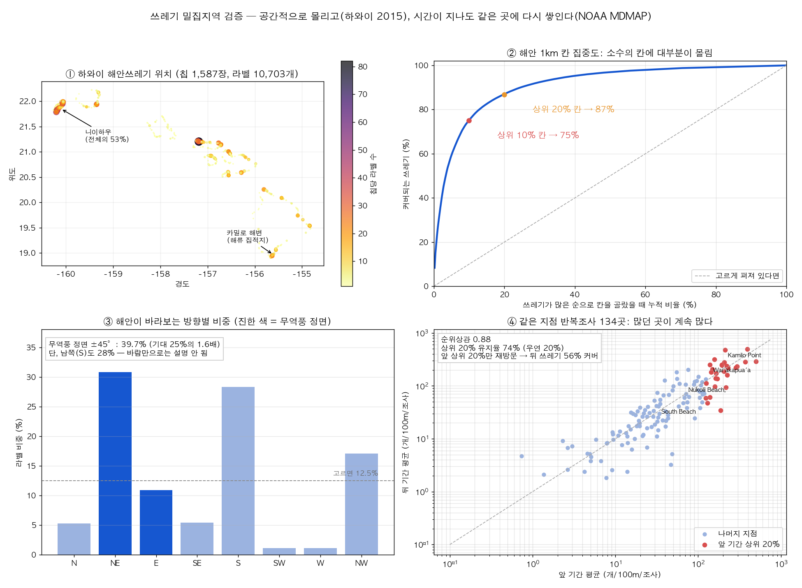
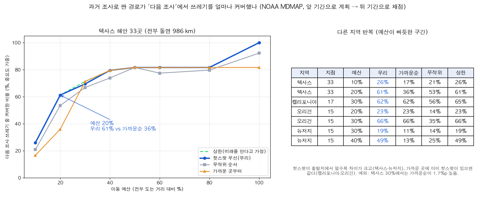
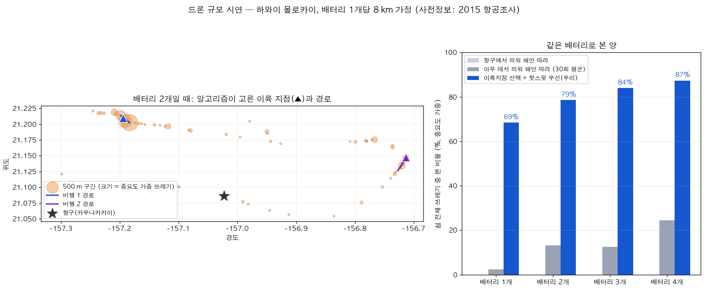

# 핫스팟 우선 경로 — 발표 정리

> 해안 전체를 매번 다 날 수 없다. 쓰레기는 소수 구간에 몰리고, 그 구간은 치워도
> 다시 쌓인다. 그래서 **과거 조사를 바탕으로 "많고 중요한 곳"을 배터리 예산 안에서
> 최대로 보는 경로**를 자동으로 짠다.

## 1. 핵심 숫자 (슬라이드 한 장용)

| 주장 | 근거 | 숫자 |
|---|---|---|
| 쓰레기는 몰린다 | 하와이 2015 항공조사, 라벨 10,703개 | 해안 1 km 칸 **상위 10%에 75%** |
| 몰린 곳은 다시 쌓인다 | NOAA MDMAP 같은 지점 반복조사 134곳 | 앞/뒤 기간 순위상관 **0.88**, 상위 20% 유지율 **74%** (우연 20%) |
| 과거로 짠 경로가 미래에도 통한다 | MDMAP 텍사스 33곳, 앞 기간으로 계획 → 뒤 기간으로 채점 | 예산 20%에서 **61% 커버** (가까운순 36%, 무작위 53%) |
| 드론 배터리 1개로 많이 본다 | 하와이 몰로카이 시연, 배터리당 8 km 가정 | **69%** vs 아무 데서 띄워 해안 따라 2% |

## 2. 왜 핫스팟 우선인가 — 근거



- **① ②** 하와이 해안 전체를 2 cm/px로 찍은 공개 항공조사(Zenodo 8381113). 쓰레기가
  있는 1 km 칸 434개 중 상위 10%가 75%, 상위 20%가 87%를 차지한다. 빈 해안 칸까지
  넣으면 이 비율은 더 오른다.
- **③** 무역풍을 정면으로 받는 해안에 평균의 1.6배가 몰리지만, 하와이섬은 남쪽(해류
  집적지 카밀로)에 몰려 있다 → **바람 하나로는 못 맞힌다. 실제 조사 이력이 필요하다.**
- **④** NOAA MDMAP은 같은 100 m 구간을 반복 조사하며 매번 다 치운다. 즉 각 값이
  "치운 뒤 다시 쌓인 양"이다. 134곳에서 앞 기간에 많던 곳이 뒤 기간에도 많았다
  (순위상관 0.88). 하와이 1위 지점은 카밀로 — ③에서 본 그 집적지다.

## 3. 알고리즘

### 문제 정의
**오리엔티어링 문제(Orienteering Problem)**: 후보 구간마다 가치가 있고, 이륙 지점에서
출발해 돌아오는 비행거리가 배터리 예산 B를 넘지 않으면서 방문 구간 가치의 합을
최대화한다. 모든 곳을 도는 외판원 문제(TSP)와 달리 **"어디를 포기할지"를 같이 정한다.**

### 구간 가치 = 많이 × 중요하게 + 새로운 곳 탐색
```
가치 = 기대 쓰레기량 × 중요도  +  β · (과거 편차 / √조사횟수)
```
- **기대 쓰레기량**: 그 구간의 과거 조사 평균 (반복성 0.88로 근거 확보)
- **중요도**: 무겁거나 치우기 어려워 트럭·인력 계획을 바꾸는 것에 가중치
  (어망·로프·부표·선박 5, 타이어 4, 줄 3, 금속·목재 2, 기타 조각 1 — **가정값**)
- **탐색 보너스(β)**: 조사 횟수가 적어 불확실한 구간에 가산. 많던 곳만 계속 보면
  새로 생긴 핫스팟을 영영 못 찾기 때문 (UCB 방식).

### 풀이 (`path_planning/hotspot_route.py`)
1. **삽입 휴리스틱**: 남은 예산 안에서 `가치^α / 추가거리`가 가장 큰 구간을 경로의
   가장 싼 위치에 끼워 넣기를 반복. α를 0.5~3으로 바꿔가며 여러 번 실행
   (α가 작으면 가까운 곳 위주, 크면 큰 핫스팟 위주).
2. **2-opt**: 경로 순서를 다듬어 거리를 줄이고, 줄어든 만큼 구간을 더 넣는다.
3. **지역 탐색**: 구간 하나를 빼고 다시 채워서 총가치가 오르면 채택.
4. **이륙 지점 선택**(`plan_with_launch`): 드론은 항속거리가 짧아서 어디서 띄우느냐가
   결과를 가장 크게 바꾼다. 후보 이륙 지점마다 경로를 짜보고 가장 좋은 쌍을 고른다.
5. **배터리 여러 개**: 한 번 비행을 짜고, 본 구간을 빼고 다음 비행을 짠다.

검증에서 "미래를 안다고 가정한 상한"과 비교했을 때 차이는 최대 3.2%p였다
(캘리포니아 예산 30%). 즉 과거 기록만으로도 미래를 아는 경우와 거의 같은 경로가 나온다.

## 4. 검증 1 — 과거로 짠 경로가 미래에도 통하나 (MDMAP)



- **설계**: 지점별 조사를 시간순으로 앞/뒤 절반으로 나눈다. 앞 절반으로만 경로를
  짜고, **뒤 절반의 실제 쓰레기**로 채점한다. 진짜 미래 예측이다.
- **규모 주의**: MDMAP 지점은 수십~수백 km 떨어져 있어서, 이 실험은 드론 한 번
  비행이 아니라 **"이번 달 조사팀을 어느 해변에 보낼까"** 규모의 검증이다.
  알고리즘은 같고 거리 단위만 다르다.
- **결과(정직하게)**:
  - 대부분 비교방법 이상이었다. 예외 하나: 텍사스 예산 30%에서 가까운순이 71.2%로
    우리(69.5%)보다 1.7%p 높았다.
  - **핫스팟이 출발지에서 멀 때 차이가 크다**: 텍사스 예산 20%에서 61% vs 가까운순
    36%, 뉴저지 예산 40%에서 49% vs 13%.
  - **가까운 곳에 이미 핫스팟이 있으면 같다**: 캘리포니아·오리건은 가까운순과 동일.
  - 탐색 보너스는 이 데이터에서 결과를 바꾸지 않았다(모든 지점이 이미 7회 이상
    조사돼 불확실성이 작음). 처음 조사하는 지역에서 의미가 있는 기능이고, 검증은
    아직이다.

## 5. 검증 2 — 드론 규모 시연 (하와이 몰로카이)



- 해안을 500 m 구간 65개로 나누고, 2015 조사를 "가장 최근 조사"로 사용.
  배터리 1개당 비행거리 8 km로 가정.
- 몰로카이의 핫스팟은 북서쪽 해안이고, 항구(★)에서 25 km 이상 떨어져 있다.
  **항구에서 띄우면 어떤 경로를 짜도 거의 못 본다(0%).**
- 알고리즘이 이륙 지점(▲)까지 고르면 **배터리 1개로 69%, 2개로 79%**를 본다.
  아무 데서나 띄워 해안을 따라 훑으면 2~25%.
- **이 시연은 검증이 아니다**: 사전정보와 채점에 같은 2015 데이터를 썼다. 미래에도
  통한다는 근거는 검증 1이 담당한다. 또 이륙 후보를 "쓰레기 구간 어디든 차로 접근
  가능"으로 가정했다.
- 참고: 비교방법(해안 따라)도 쓰레기가 있는 구간만 훑도록 해서, 실제보다 유리하게
  잡았다. 실제로는 빈 해안에도 배터리를 쓰므로 차이는 더 크다.

## 6. 전체 파이프라인에서의 위치

```
[이력] 과거 조사·수거 기록 (+ 첫 조사가 없으면 지형·풍향 사전값 + 탐색 보너스)
   ↓  hotspot_route: 이륙 지점 + 배터리별 경로
[1차 비행] 경로를 KMZ로 내보내 DJI Fly 웨이포인트로 자동 비행 (Mini 5 Pro 지원, 실기체 확인 필요)
   ↓  탐지·위치·시점 확인 (coastal-litter-pipeline)
[2차 비행] 무게 구간이 23 kg·마대·트럭 경계에 걸리는 물체만 선회 촬영 → 3D 부피·무게
   ↓
[수거계획] 마대·트럭·인원·경로 대시보드 (shoresweep-planner)
   ↓
[이력 갱신] 이번 결과가 다음 비행의 "과거 조사"가 된다  ← 반복할수록 정확해짐
```

## 7. 슬라이드 구성안

1. **문제** — 해안쓰레기 7.8만 톤/년(수거량의 69%). 해안 전체를 매번 정밀 조사할 수 없다.
2. **발견 1: 몰린다** — 하와이 지도 + 집중 곡선. "상위 10% 칸에 75%"
3. **발견 2: 다시 쌓인다** — MDMAP 산점도. "순위상관 0.88, 상위 20% 유지 74%"
4. **해법** — 오리엔티어링: 배터리 예산 안에서 "많이 × 중요하게" 보는 경로 + 이륙 지점
5. **검증** — 텍사스 곡선. "과거로 짠 경로가 다음 조사에서 61% vs 36%"
6. **시연** — 몰로카이 지도. "항구에서 띄우면 0%, 이륙 지점을 고르면 배터리 1개로 69%"
7. **연결** — 1차 비행 → 탐지 → 2차 선회 → 무게 → 수거계획 → 이력 갱신

## 8. 예상 질문

- **"많던 곳만 보면 새 쓰레기는 놓치지 않나?"** — 탐색 보너스로 조사가 적은 구간에
  가산한다. 또 MDMAP에서 앞 기간 상위 20%만 다시 가도 뒤 기간 쓰레기의 56%를
  커버했다 — 나머지 44%를 위해 예산 일부를 탐색에 쓰는 구조다.
- **"이력이 없는 첫 조사는?"** — 첫 조사는 전체 커버리지 비행(지그재그, 기존
  `coverage.py`)으로 하고 그 결과가 이력이 된다. 지형·풍향은 약한 사전값으로만 쓴다
  (하와이에서 풍향만으로는 섬마다 맞고 틀림이 갈렸다).
- **"중요도 가중치는 어디서?"** — 현재 가정값이다. 업체 무게 실측 데이터나 수거
  기록이 생기면 "트럭·인력 계획을 바꾼 정도"로 교체해야 한다.
- **"한국 데이터는?"** — 국가 해안쓰레기 모니터링(2008~, 정점 정기조사)이 같은
  구조다. 정점별 시계열을 받으면 같은 스크립트(`hotspot/mdmap_persistence.py`,
  `exp_texas.py`)로 바로 검증할 수 있다.
- **"배터리 8 km는?"** — 가정값이다. 실제 기체로 해안 비행 1회를 재서 바꿔야 한다.

## 9. 한계와 가정값

| 항목 | 현재 | 바꾸려면 |
|---|---|---|
| 데이터 | 해외 공개 데이터(하와이·미국) | 국내 정점별 모니터링, 업체 다른 날짜 촬영본 |
| 하와이 표본 | 쓰레기가 있는 칩만 담긴 학습용 표본 | 원 조사 전수 점 데이터(하와이 DAR 보유) |
| 중요도 가중치 | 가정값 | 실측 무게·수거 기록 |
| 배터리 거리 | 8 km 가정 | 실기체 측정 |
| 이륙 지점 | 쓰레기 구간 어디든 접근 가능 가정 | 도로·주차 가능 지점 목록 |
| MDMAP 지점 | 자원봉사자가 고른 곳(무작위 아님) | — |
| 탐색 보너스 | 기능은 있으나 효과 미검증 | 신규 지역 시뮬레이션 |

## 10. 재현

```bash
cd hotspot
python3 windward_test.py            # 하와이 공간 집중·해안 방향 (data/ 필요: Zenodo 8381113)
python3 mdmap_persistence.py        # MDMAP 반복성 (공개 API에서 받아 data/mdmap/ 캐시)
python3 plot_results.py             # hotspot_results.png
python3 exp_texas.py Texas          # 검증 1 (California / Oregon / "New Jersey"도 가능)
python3 exp_hawaii_drone.py         # 검증 2 (몰로카이)
python3 plot_route_results.py       # route_eval_mdmap.png, route_demo_molokai.png
```

## 출처

- Zenodo 8381113 — Large-area automatic detection of shoreline stranded marine debris (하와이 2015 항공조사, CC-BY 4.0) https://zenodo.org/records/8381113
- NOAA Marine Debris Monitoring and Assessment Project (MDMAP) https://marinedebris.noaa.gov/monitoring/monitoring-toolbox
- 하와이 2015 조사 결과 보도 https://www.honolulumagazine.com/?p=38323
- 해양쓰레기 수거량(해안 69%) https://www.dailian.co.kr/news/view/970989/
- GIS 기반 해안쓰레기 집적 예측 https://agris.fao.org/search/en/records/65df56797c7033e84bed7217
