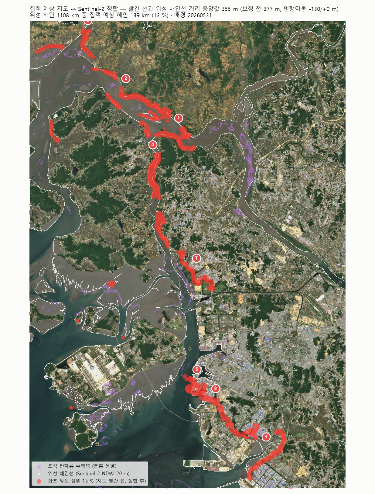
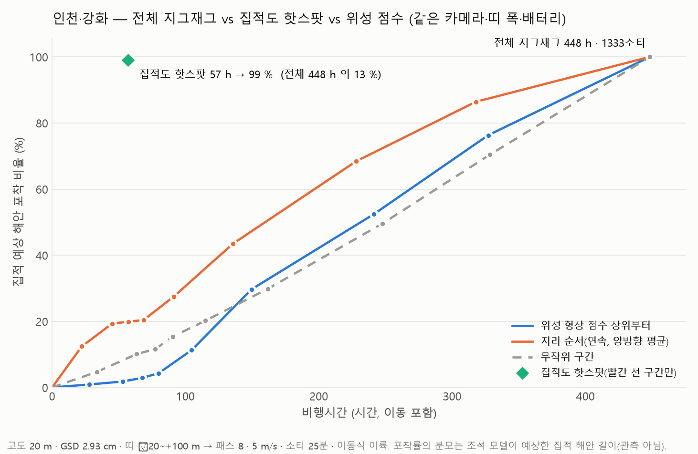
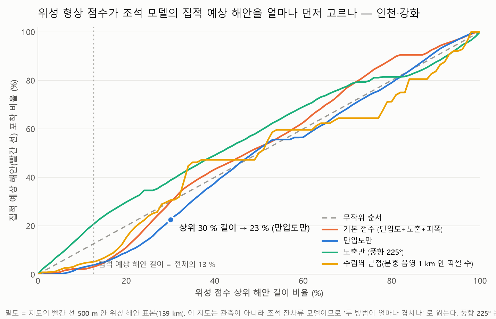
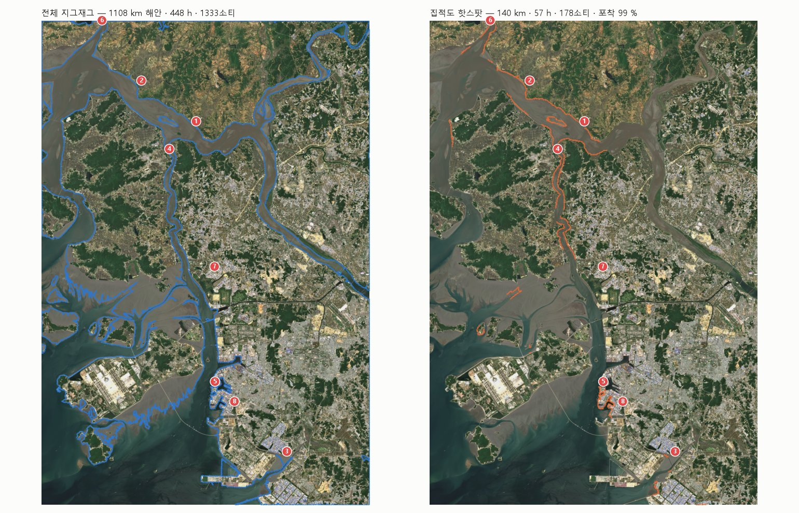

# 인천·강화 — 집적 예상 지도를 위성영상에 정합하고, 그 해안만 나는 경로가 전체 탐지보다 얼마나 이득인지 (2026-10-02)

> 입력은 조석 잔차류 모델이 낸 **"해양쓰레기 집적 예상 해안" 지도 한 장**(`input/인천_집적예상도.webp`: 빨간 반투명 선 = 좌초 밀도 상위 15 %, 점선 = 해상 체류 밀도 상위 5 %, 분홍 음영 = 잔차류 수렴역, 상위 8개 해안 112.4 km).
> 이 지도를 Sentinel-2 에 정합해 "집적 예상 해안" 을 위성 해안선 위의 구간으로 바꾸고, 앞서 만든 경로 최적화·전략 비교 모델(`litter3d/priority.py`, `litter3d/strategy.py`)로 **그 구간만 나는 비행**과 **기존처럼 해안 전체를 지그재그로 훑는 비행**의 비용을 같은 조건에서 비교했다.

## 0. 결론 먼저

| 질문 | 답 (고도 20 m · GSD 2.9 cm · 띠 −20~+100 m · 8패스 · 소티 25분) |
|---|---|
| 인천·강화 위성 해안은 얼마나 긴가 | **1,108 km** (Sentinel-2 20 m NDWI, 둘레 22개, 갯벌 가장자리 포함) |
| 집적 예상 해안은 그중 얼마인가 | **140 km = 13 %** (지도 빨간 선 500 m 안의 위성 해안; 지도 범례 8개 합 112 km) |
| 전체를 지그재그로 훑으면 | **448 h · 1,333 소티 · 160만 프레임** (탐지 CPU 98 h · 624 GB) |
| 집적 예상 해안만 날면 | **57 h · 178 소티 · 20만 프레임** (12 h · 79 GB) → **시간·소티·프레임 모두 전체의 13 %** |
| 그 대가는 | 집적 예상 해안 밖 87 % 의 해안은 관측 자체가 없다. "99 % 포착" 은 조석 모델이 맞다는 가정 아래의 값이고, **인천 해안의 실측 쓰레기 자료가 없어 검증하지 못했다** |
| 앞서 만든 위성 형상 점수(만입도·노출·띠 폭)로 이 핫스팟을 찾을 수 있나 | **못 찾는다.** 같은 13 % 길이에서 형상 점수는 집적 예상 해안의 3 % 만 고른다(무작위 12 %, 출발지부터 연속 20 %). 조석 모델의 핫스팟은 만(灣)이 아니라 **하구 수로**(한강하구·염하수로·경인항·북항)라, 외해 해안의 좌초 물리로 만든 형상 점수와 겹치지 않는다 |
| 그래서 인천에서는 | **조석 모델이 1차 선별, 위성은 해안선 정합·갱신과 구간 안 세분화.** 니하우·문갑도(외해 섬)에서는 형상 점수가, 하구에서는 수리 모델이 맞는 도구다 |



## 1. 방법 — 이미지 한 장을 어떻게 좌표로 바꿨나

1. **축 눈금 검출 → 지오레퍼런싱.** 지도는 경위도 축(x 126.0~126.8, y 37.2~37.8 눈금)의 등거리 종횡비 플롯이다. 프레임 바깥의 눈금 표시를 픽셀에서 찾아(`outputs/axes_detect.json`) 1차 변환을 맞췄다: 1,357.5 px/° (경도), 1,707.0 px/° (위도), 잔차 2×10⁻⁴° 이하. 픽셀 하나 ≈ **65 m**. 월드파일 `input/인천_집적예상도.wld` 를 만들어 QGIS 등에서 그대로 겹칠 수 있다.
2. **레이어 추출.** 색으로 분리했다. 빨간 선(R 높고 G·B 낮음) → 번호 원 8개를 크기로 제거 → 5×5 열림 연산으로 두꺼운 실선(좌초 밀도)과 얇은 점선(해상 체류)을 나눴다. 분홍 음영(R·B 높고 G 낮음) = 수렴역. 범례 상자는 제외. 결과 `outputs/mask_red_core.png`(20,497 px), `mask_pink.png`(14,564 px).
3. **Sentinel-2 정합.** 타일 52SBG, 창 `264000 4133000 309000 4199500`(EPSG:32652, 45×66 km)을 **20 m** 로 받았다(`tools/fetch_s2_aws.py --res 20`, 장면 2026-05-01·05-31·06-15·09-16, 창 안 구름 0.0~0.3 %, SCL 로 빈 곳 제외). NDWI 최댓값 합성 → 육지 마스크 → 해안 20 m 표본점 55,392개(1,108 km). 빨간 선 픽셀에서 위성 해안선까지 거리 중앙값이 가장 작아지는 평행이동을 ±260 m 안에서 찾았다 → **−130 m / 0 m**, 중앙값 377 → **355 m**, 500 m 안 56 %.
   - 남는 오차의 원인: 지도 해안선이 GSHHG 모식도(수백 m 오차, 송도·소래 매립지 반영 안 됨)이고 픽셀이 65 m 라서다. 빨간 선의 10 % 는 위성 해안에서 4.7 km 이상 떨어져 있다(한강 상류 쪽 창 밖 구간, 매립 전 해안).
4. **집적 예상 해안 = 빨간 선 500 m 안의 위성 해안 표본.** 140 km(13 %). 가장 가까운 번호 원으로 8개 해안에 배정했다. 버퍼를 1 km 로 넓힌 민감도는 `outputs_prior1000/`.
5. **비교.** `litter3d/strategy.py` 그대로: 같은 카메라(기존 시뮬 sim_ortho 의 1024×768·HFOV 73.7°·고도 20 m), 같은 띠 폭(해안선 바다쪽 20 m ~ 안쪽 100 m → 평행선 8개), 조사 5 m/s·이동 10 m/s·소티 25분·이동식 이륙, 같은 소티 계획기. 밀도(포착률의 분모)는 집적 예상 해안 표본(길이 가중).

## 2. 결과

### 2.1 전체 지그재그 vs 집적도 핫스팟 (그림 32)



| 전략 | 해안 | 조사 km | 이동 km | 비행 h | 소티 | 프레임 | 탐지 CPU h | 집적 예상 해안 포착 |
|---|---|---|---|---|---|---|---|---|
| **전체 지그재그 (기존)** | 1,108 km (100 %) | 7,992 | 156 | **448** | 1,333 | 1,598,424 | 98 | 100 % |
| **집적도 핫스팟 (빨간 선 구간만)** | 140 km (13 %) | 1,011 | 21 | **57** | 178 | 202,260 | 12 | 99 % (정의상) |
| 위성 형상 점수 상위 13 % | 140 km | 1,172 | 90 | 68 | 219 | 234,413 | 14 | 3 % |
| 출발지(북항)에서 연속 13 % (양방향 평균) | 140 km | 1,023 | 19 | 57 | 167 | 204,594 | 13 | 20 % |
| 무작위 13 % (5회 평균) | 140 km | 1,054 | 678 | 77 | 246 | 210,769 | 13 | 12 % |

전체 표(5~70 %)는 `outputs/비교표.md`. 핫스팟 구간이 연속이라 간격 메움은 효과가 없다(57 h 동일).
버퍼를 500 m → 1 km 로 넓히면(`outputs_prior1000/`) 집적 예상 해안 198 km(18 %), 핫스팟 81 h·251소티·28.7만 프레임(전체의 18 %), 형상 점수 포착 10 %(무작위 18 %)로 결론은 같다.

### 2.2 해안별 비행 계획 (집적 예상 상위 8개, `outputs/해안별_비행계획.md`)

| 순위 | 해안 | 지도 km | 위성 해안 km | 소티 | 비행 h | 프레임 | 비고 |
|---|---|---|---|---|---|---|---|
| 1 | 김포 서안(한강하구) | 10.6 | 17.3 | 22 | 7.1 | 25,437 | 접경·한강하구, 비행 허가 필요 |
| 2 | 강화 북안(조강 연안) | 17.1 | 23.4 | 29 | 9.7 | 34,464 | 접경, 비행 허가 필요 |
| 3 | 소래·시흥 연안 | 21.9 | 8.2 | 11 | 3.4 | 11,947 | 매립으로 지도 해안선과 다름(정합 부분 실패) |
| 4 | 강화 동안(염하수로) | 22.8 | 33.0 | 42 | 13.4 | 47,743 | 양안 포함, 접경 |
| 5 | 인천 북항·연안부두 | 11.1 | 13.0 | 18 | 5.1 | 17,941 | 항만 비행 제한 확인 |
| 6 | 북한 개풍 연안 | 12.1 | 12.2 | 16 | 5.0 | 17,685 | **비행 불가** |
| 7 | 인천 서구 청라·경인항 | 11.1 | 20.6 | 26 | 8.5 | 30,377 | |
| 8 | 송도 | 5.7 | 10.4 | 13 | 4.1 | 14,413 | 매립지 해안선 갱신 필요 |

- 합계 138 km · 177 소티 · 56 h. 이 중 **당장 날 수 있는 4개(3·5·7·8) = 52 km · 68 소티 · 21 h**, 접경·북한 4개(1·2·4·6) = 86 km · 109 소티 · 35 h.
- 위성 해안 km 가 지도 km 와 다른 곳은 지도가 매립 전 해안선(GSHHG)이거나 양안을 세었기 때문이다. **송도·소래는 위성 해안선으로 갱신해야 한다** — 이것이 인천에서 위성이 하는 일이다.

### 2.3 위성 형상 점수는 이 핫스팟을 찾지 못한다 (그림 31)



| 점수 | 상위 10 % 길이 | 13 % | 20 % | 30 % | 50 % |
|---|---|---|---|---|---|
| 기본 (만입도+노출+띠 폭) | 2 | 3 | 11 | 30 | 52 |
| 만입도만 | 3 | 4 | 9 | 23 | 52 |
| 노출만 (풍향 225° 가정) | 16 | 20 | 30 | 39 | 59 |
| 수렴역 근접 (분홍 음영) | 4 | 6 | 15 | 31 | 50 |
| 무작위 | 10 | 13 | 20 | 30 | 50 |

니하우(만입도만 30 % → 53 %)·문갑도(62 %)와 정반대다. 이유는 대상이 다르기 때문이다. 조석 모델의 상위 8개는 모두 **하구 수로와 항만 안벽**(직선·인공 해안)이고, 형상 점수는 **오목한 만·바람맞이 해빈**을 찾는다. 수렴역(분홍) 근접도 무작위 수준인 것은 음영이 해상(수로 한가운데)에 있어 해안 표본과 1 km 안에서 잘 안 만나기 때문이다.



## 3. 이점은 어디까지 "확실"한가

- **확실한 것**: 집적 예상 해안만 날면 전체 지그재그 대비 비행시간·소티·프레임·처리량이 **1/8** 이다. 이건 기하와 길이에서 바로 나오는 숫자다(140 km vs 1,108 km, 둘 다 같은 8패스).
- **조건부인 것**: "그래도 쓰레기의 99 % 를 본다" 는 조석 모델이 맞을 때 얘기다. 모델이 놓친 해안(예: 바람·파랑으로 쌓이는 외해 쪽 섬 해안)은 0 % 로 계산된다. 인천 해안의 **실측 쓰레기 분포 자료가 없어 이 가정을 검증하지 못했다.**
- **위성 형상 점수의 역할은 바뀐다**: 여기서는 선별 도구가 아니라 (1) 매립·준설로 바뀐 해안선 갱신(송도·소래), (2) 조석 모델 핫스팟 안에서 200 m 구간 단위의 우선순위(띠 폭·접근성), (3) 조석 모델이 없는 외해 섬(덕적·자월 등)의 선별이다.

## 4. 한계

- 입력이 **이미지**다. 65 m 픽셀, GSHHG 모식도 해안선, 상위 15 % 만 그려진 이진 정보. 원본 격자(좌초 밀도·잔차류 netCDF/GeoTIFF)가 있으면 정합 오차(중앙값 355 m)와 "상위 15 % 밖" 정보 손실이 모두 없어진다. **→ 모델 원본 자료를 받으면 바로 교체할 수 있게 스크립트를 짜 두었다(`--prior-dist`, 마스크 npy 입력).**
- 위성 해안 1,108 km 는 **갯벌 가장자리**를 포함한다(서해 조차 8 m, 4개 장면의 최고조 합성). 전체 커버리지 비용(448 h)은 갯벌을 해안으로 센 만큼 과대일 수 있다. 핫스팟 쪽(140 km)은 하구·항만이라 영향이 작다.
- 접경(한강하구·조강·염하수로)과 북한 연안은 드론 비행이 제한·불가하다. 상위 8개 중 4개가 여기 든다.
- 비행 가정값(고도·속도·배터리·겹침·프레임 간격)은 니하우 비교와 같다. 절대값이 아니라 비율(1/8)로 읽는다.
- 포착률 분모가 모델 예측이라 **관측 기반 검증이 아니다.** 니하우 분석(탐지 격자 기반)과 같은 선상에 놓을 수 없다.

## 5. 더 필요한 자료 (있으면 결과가 달라지는 순서)

1. **조석 모델 원본 격자**: 좌초 밀도(전 범위, 상위 15 % 뿐 아니라), 해상 체류 밀도, 잔차류 u·v — netCDF/GeoTIFF/CSV. 격자 간격과 좌표계.
2. **인천 해안 실측 쓰레기 자료**: 해안쓰레기 모니터링 지점별 개수·무게(해양환경공단 국가 해안쓰레기 모니터링, 인천시·옹진군 수거 실적 구간별), 또는 드론 촬영 라벨. 이것이 있어야 "집적도 핫스팟이 실제 무게의 몇 % 를 잡나" 를 니하우처럼 잴 수 있다.
3. 비행 제한 구역 경계(접경·항만·공항 관제권): 해안별 비행 계획에서 날 수 있는 구간만 남기기 위해.
4. 조사 시점의 풍향·풍속(최근 2~3개월): 노출 점수를 쓸 경우.

## 6. 파일과 재현

```
incheon/
  README.md                         이 문서
  input/인천_집적예상도.webp(.wld)   원본 지도 + 월드파일(EPSG:4326)
  scripts/20_incheon_hotspot.py      정합 → 추출물 매칭 → 전략 비교 → 해안별 계획 → 그림·표
  outputs/axes_detect.json, georef.json   눈금 검출, 픽셀→경위도 변환, 번호 원 좌표
  outputs/mask_red_core.png, mask_red_all.png, mask_pink.png   추출 마스크 (이미지 픽셀 격자)
  outputs/30~33_*.png/jpg, 비교표.md/csv, 해안별_비행계획.md/csv, summary.json
  outputs_prior1000/summary.json, 비교표.md   버퍼 1 km 민감도
```

```bash
# 1) 지도 눈금·마스크 (README 1·2절; 코드는 scripts 상단 주석과 같은 절차, 결과가 outputs/ 에 있음)
# 2) Sentinel-2 20 m
python tools/fetch_s2_aws.py --tile 52SBG --bounds 264000 4133000 309000 4199500 --res 20 --bands B03,B08,B04,TCI,SCL \
    --scenes S2B_52SBG_20260501_0_L2A,S2B_52SBG_20260531_0_L2A,S2C_52SBG_20260615_0_L2A,S2C_52SBG_20260916_0_L2A --out input/s2_incheon --prefix incheon
# 3) 정합·비교 (약 4분)
python incheon/scripts/20_incheon_hotspot.py --s2-dir input/s2_incheon --scenes 20260501,20260531,20260615,20260916 --tci-scene 20260531 --wind-from 225 --out incheon/outputs
```
저장소 루트에서 실행한다(`litter3d` 를 가져온다). Windows 콘솔은 `PYTHONUTF8=1`.
