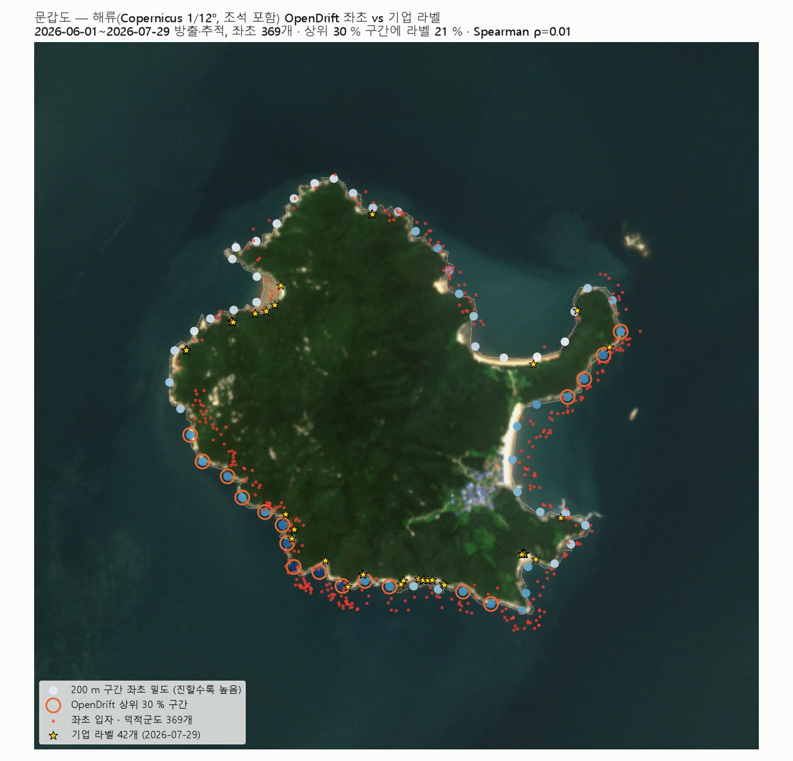
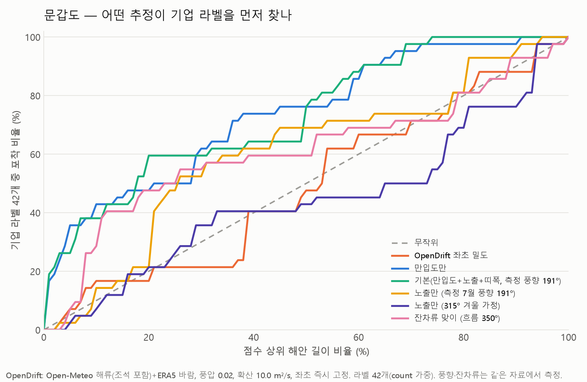

# 문갑도 — 해류로 "어디에 쌓이나"를 OpenDrift 로 추정하고, 기업이 드론으로 찍은 라벨과 맞춰 보기 (2026-10-02)

> 한 문장: **공개 해류·바람 자료(조석 포함)** 로 조사일(2026-07-29) 전 8주 동안 쓰레기 입자를 흘려보내 문갑도 어느 해안에 닿는지 세고, 그 결과를 **기업이 같은 날 드론으로 찍어 라벨링한 42개 위치** 와 비교했다.

## 0. 결과 요약 — 썼더니 이렇게 나왔다

| 물음 | 답 |
|---|---|
| 입자가 문갑도에 닿았나 | 외해 12,000개 중 **369개** 가 문갑도 해안에 좌초(62개 구간 중 54개). 한강 하구 4,000개는 **0개** — 58일 안에 하구를 못 벗어나 하구 양안에 좌초 |
| 어느 구간인지 맞혔나 | **못 맞혔다.** 200 m 구간 단위로 좌초 수와 라벨 수의 순위 상관 ρ = −0.18(p 0.17), 평활 밀도 ρ = 0.01. 좌초 밀도 상위 30 % 길이에 라벨 **21 %**(무작위 30 % 보다 낮음) |
| 어느 '면'인지는 맞혔나 | **대체로 맞혔다.** 남향 면(SE·S·SW) 좌초 43~60개/km vs 북·서 면 13~17개/km. 라벨도 SE 11.5개/km 로 최다, SW 4.4, S 3.8. 다만 **동쪽(E)** 은 모형 32개/km 인데 라벨 0개 — 덕적도와 마주한 좁은 수로를 8 km 격자가 못 그린다 |
| 같은 해류·바람 자료를 더 잘 쓰는 법 | 입자 추적 대신 **통계만 뽑아 형상 점수의 방향 입력으로** 쓰는 쪽이 섬 규모에서는 나았다: 측정 7월 풍향 191° 로 노출 점수 → 라벨 52 %(상위 30 %), 잔차류 방향 350° 로 '잔차류 맞이' 점수 → **55 %**. 둘 다 무작위(30 %)를 크게 넘고, 가정값 195° 와 측정값이 거의 같아 전에 쓴 가정이 맞았음을 확인 |
| 여전히 최고는 | 위성 **만입도만 62 %**(상위 30 %). 기본 점수(측정 풍향) 60 % |
| 비행 비용 | 전체 지그재그 12.3 km → 5.0 h·15소티. 상위 30 %(3.6 km)만 날면 OpenDrift 기준 1.5 h·5소티·라벨 21 %, 만입도 기준 2.2 h·7소티·라벨 50 % |



**한 줄 해석.** 8 km 해류로 돌린 OpenDrift 는 "남쪽에서 온다" 는 방향은 맞히지만 "섬 둘레 어느 200 m 인지" 는 못 맞힌다. 섬 규모의 선별은 해류 자료에서 **풍향·잔차류 방향**을 뽑아 위성 형상 점수에 넣는 쪽이 정확하고 싸다. 입자 추적이 제 몫을 하려면 섬 주변 수로를 그리는 수백 m 조류장(국립해양조사원)이 필요하다.


## 1. 무엇을 썼나

| 재료 | 출처 | 비고 |
|---|---|---|
| 표층 해류 | Open-Meteo Marine API ← Copernicus Marine / Météo-France **SMOC "Currents, Tides"** 1/12°(≈8 km), 시간별 | `ocean_current_data/data/currents_2026-06-01_2026-09-30.nc`. 문갑도 주변 격자에 결측 없음. 조석 포함(12 h 주기 확인) |
| 10 m 바람 | Open-Meteo Historical API (ERA5 기반) 0.25° | `ocean_current_data/data/wind_*.nc` |
| 표류·좌초 모형 | **OpenDrift 1.14.11** `OceanDrift` (GPL-2.0, MET Norway) | 해류 + 풍압 2 %(0.5~1.5배 분포) + 수평 확산 10 m²/s, RK4 20분, 해안 접촉 시 `stranded` 로 고정 |
| 해안선 | Sentinel-2 10 m (2026-06-15·08-04·09-16) NDWI 최댓값 합성 → 문갑도 둘레 12.3 km, 200 m 구간 62개 | `input/s2_mungap/` (`tools/fetch_s2_aws.py`) |
| 비교 대상 | 기업 드론 조사 라벨 42개 (2026-07-29, 중심 경위도) | `input/labels.json` → `input/s2_mungap/labels_42.csv` (기업 자료라 git 제외) |
| 다른 추정(대조군) | 위성 형상 점수: 만입도만 / 기본(만입도+노출+띠 폭) / 노출만 / 잔차류 맞이 | `litter3d/priority.py`, `strategy.py` |

바람과 잔차류는 가정이 아니라 **같은 자료에서 조사 직전 기간을 평균해 측정**했다: 7월 바람은 191° 에서 5.2 m/s(남남서풍), 6~7월은 214°; 섬 주변 잔차류는 350° 쪽으로 0.06 m/s(약함), 조류 속력 중앙값 0.60 m/s.

## 2. 어떻게 했나

1. **입자 방출.** 두 시나리오. (a) 덕적군도 주변 외해(125.85~126.40 E, 37.00~37.36 N) 균일 12,000개 — 해상 기인·외부 유입. (b) 한강 하구 합류 수역(126.56~126.66 E, 37.74~37.80 N) 4,000개 — 육상 기인. 방출 시각은 6월 1일부터 조사 2일(한강은 10일) 전까지 균일, 조사일 00시까지 추적.
2. **표류·좌초.** OpenDrift 가 매 20분 해류·바람으로 입자를 옮기고, GSHHG 지상 마스크에 닿으면 그 자리에 고정한다. 방출 직후(첫 출력 전) 좌초한 입자는 섬 위에 뿌려진 것이라 뺀다.
3. **문갑도 해안에 집계.** 좌초 위치에서 위성 해안 표본점(10 m)까지 1.5 km 안이면 그 구간(200 m)에 센다. 1 km 이동평균으로 밀도 점수를 만든다.
4. **라벨과 비교.** 세 가지 방법으로. (i) 점수 상위 X % 길이 안에 라벨 몇 % 가 드는지(포착 곡선) — 만입도·노출·잔차류 맞이·무작위와 같은 축에서. (ii) 200 m 구간 단위 Spearman 순위 상관. (iii) 해안 방위(8방위)별 라벨/km 와 좌초/km.
5. **경로 비용.** 같은 카메라(20 m)·띠 폭으로 전체 지그재그 vs OpenDrift 상위 30 % vs 만입도 상위 30 % 의 비행시간·소티와 라벨 포착.

## 3. 결과 — 숫자

### 3.1 어떤 추정이 라벨을 먼저 찾나 (상위 X % 해안 길이 안의 라벨 비율, %)

| 점수 | 10 % | 20 % | 30 % | 50 % |
|---|---|---|---|---|
| OpenDrift 좌초 밀도 (8 km 해류) | 17 | 17 | 21 | 48 |
| 만입도만 (위성) | 43 | 48 | **62** | 76 |
| 기본 = 만입도 + 노출(측정 191°) + 띠 폭 | 38 | 60 | 60 | 76 |
| 노출만 (측정 7월 풍향 191°) | 14 | 21 | 52 | 69 |
| 노출만 (315° 겨울 가정) | 7 | 21 | 36 | 43 |
| 잔차류 맞이 (측정 흐름 방향 350° 를 마주보는 해안) | 29 | 48 | 55 | 60 |
| 무작위 | 10 | 20 | 30 | 50 |



### 3.2 해안 방위별 — 라벨과 좌초가 같은 쪽을 가리키나

| 해안 방위 | 해안 km | 라벨 | 라벨/km | OpenDrift 좌초 | 좌초/km |
|---|---|---|---|---|---|
| N | 1.82 | 7 | 3.8 | 31 | 17.0 |
| NE | 1.43 | 0 | 0.0 | 25 | 17.5 |
| E | 1.70 | 0 | 0.0 | 55 | 32.4 |
| SE | 1.04 | 12 | **11.5** | 45 | 43.3 |
| S | 2.12 | 8 | 3.8 | 98 | 46.2 |
| SW | 1.14 | 5 | 4.4 | 68 | **59.6** |
| W | 1.81 | 3 | 1.7 | 31 | 17.1 |
| NW | 1.27 | 7 | 5.5 | 16 | 12.6 |

남향(SE·S·SW) 3개 면이 라벨 25개(60 %)·좌초 211개(57 %)로 둘 다 절반 넘게 차지한다. 어긋나는 곳은 동쪽(모형만 높음)과 북서쪽(라벨만 높음)이다. 북서쪽 라벨 7개는 마을·선착장(북서안) 주변이라 사람 기인일 수 있다.

### 3.3 측정값으로 바꾼 가정값

| 항목 | 전에 쓴 가정 | 자료에서 측정 (6~7월) |
|---|---|---|
| 풍향(불어오는 쪽) | 195° (여름 남풍 계열) | 7월 191°·5.2 m/s, 6~7월 214° |
| 잔차류 | 없음 | 350° 쪽으로 0.06 m/s (약함), 조류 속력 중앙값 0.60 m/s |

## 4. 어떻게 읽을까

- **구간 단위 예측은 실패, 방향 단위는 성공.** 원인은 해상도다. 1/12°(8 km) 격자에서 지름 4 km 섬은 점에 가깝다. 입자는 섬 그늘·곶 주변 흐름 없이 광역 흐름 + 바람으로 다가와 지상 마스크에 닿는 첫 면에서 멈춘다. 그래서 "바람·흐름을 마주보는 면" 은 맞고, 그 면 안의 어느 만(灣)인지는 못 가른다.
- **만입도가 이기는 이유.** 라벨은 면 안에서도 오목한 곳에 몰린다(만 6.4개/km vs 곶 0.5개/km, `incheon/`·`docs/위성우선순위_니하우.md`). 만입도는 그 국지 형상을 10 m 에서 읽고, 8 km 해류는 못 읽는다.
- **그래서 결합 순서.** 광역(어느 섬·어느 면) → 해류·바람 통계 또는 조석 모델, 국지(어느 200 m) → 위성 형상. 두 층을 곱하는 것이 자연스럽다: 예) 잔차류 맞이 × 만입도.
- **니하우·인천과 합쳐 보면.** 외해 섬(니하우·문갑도)에서는 위성 형상이, 하구(인천)에서는 수리 모델이 맞는다는 결론이 세 현장에서 일관된다.


## 5. 한계 (결과를 믿을 수 있는 범위)

- 해류 격자 8 km 는 섬(지름 4 km)보다 거칠다. 섬 주변 유속장은 주변 셀의 보간이라 섬 그늘·곶 주변 와류는 없다. 좌초 위치는 "어느 쪽에서 흘러오나" 수준에서만 맞는다.
- 좌초는 접촉 즉시 영구. 실제로는 재부유·역류가 있고, 라벨은 조사일 한 번의 스냅샷(그 전 몇 주~몇 달 누적)이라 시간 창이 완전히 같지는 않다.
- 방출원 가정(외해 균일·한강)과 비율(3:1)은 가정값. 어장·항로 기인 유출량이 있으면 가중을 바꾼다.
- 라벨 42개는 표본이 작아 구간 단위 상관의 p 값이 크다. 방위별 비교가 더 안정적이다.
- 파랑(Stokes 표류) 없음, 한 계절(여름)만. 겨울 북서풍이면 좌초 해안이 바뀐다.

## 6. 파일·재현

```
mungap_opendrift/
  README.md
  scripts/01_mungap_opendrift_vs_labels.py
  outputs/stranded_particles_mungap.csv   입자별 방출·좌초 위치·시각
  outputs/segments_mungap.csv             200 m 구간별 좌초 수(외해/한강)·밀도·상위 30 %·라벨 수·만입도·형상 점수
  outputs/비교표.md, summary.json, 50_mungap_stranding_vs_labels_map.png, 51_mungap_capture_curves.png
```
```bash
python mungap_opendrift/scripts/01_mungap_opendrift_vs_labels.py --start 2026-06-01 --survey 2026-07-29 --n-offshore 12000 --n-han 4000   # 약 10분
```
저장소 루트에서. 해류 파일은 `ocean_current_data/`(이미 있음), 위성 창은 `incheon/README.md`·`docs/ROUTE_OPTIMIZATION.md` 6절의 문갑도 명령, 라벨 CSV 는 `input/labels.json` 에서 `lon,lat,1` 로 만든다.
