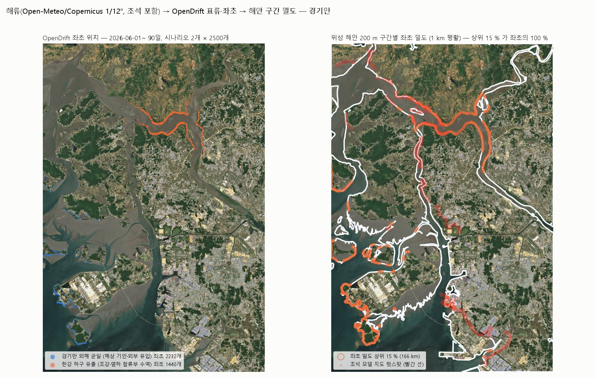
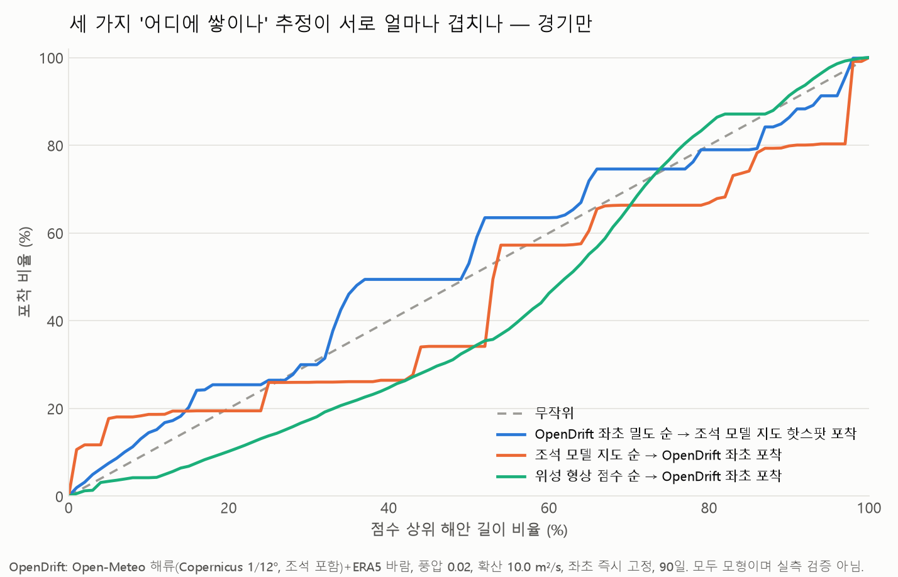

# ocean_current_data — 해류 데이터 수집 → OpenDrift 표류·좌초 시뮬 → 집적 해안 추정 → 비행 경로 (경기만, 2026-10-02)

> 1단계(해류 → 쓰레기 밀집 해안 추정)를 **공개 해류 데이터와 오픈소스 입자 추적 모형(OpenDrift)** 으로 직접 돌린 기록이다.
> 결과는 위성 해안 200 m 구간별 좌초 밀도(`outputs/segments_stranding_density.csv`)로 나와 그대로 경로 최적화(`litter3d/strategy.py`)의 점수로 들어간다.
> 모든 입력은 출처·라이선스를 `data/manifest.json` 과 아래 1절에 적었다.

## 0. 결과 요약

| 항목 | 값 |
|---|---|
| 입력 해류 | Open-Meteo Marine API ← Copernicus/Météo-France SMOC 1/12°(≈8 km), **조석 포함**, 2026-06-01~09-30 시간별, 168지점 · 바람 ERA5 0.25° |
| 시뮬 | OpenDrift 1.14.11 OceanDrift, 시나리오 2개(한강 하구 유출·경기만 외해 균일) × 2,500개, 90일, RK4 15분, 풍압 2 %, 확산 10 m²/s, 좌초 즉시 고정 |
| 좌초 | 한강 1,440개(방출 즉시 좌초 1,059 제외, 표류 중앙값 **0.25일**), 외해 2,232개(표류 중앙값 1.1일; 그중 **1,751개는 분석 창 밖** 덕적·자월·영흥 쪽 해안) → 창 안 1,903개 |
| 집적 해안 | 위성 해안 1,108 km 중 좌초가 있는 구간 **88 km(8 %)**. 좌초 50 % 가 15 km(1.4 %), 90 % 가 54 km(4.9 %)에 든다 |
| 다른 추정과 겹침 | OpenDrift 상위 15 % 길이 중 조석 모델 지도 핫스팟 **17 %**, 조석 지도 핫스팟 길이 중 OpenDrift 상위 **21 %**. 위성 형상 점수 순으로는 OpenDrift 좌초를 30 % 길이에서 17 % 만 포착(무작위 이하) |
| 경로 비용 | 전체 지그재그 1,108 km → **448 h·1,333소티** / OpenDrift 상위 15 %(166 km) → **68 h·228소티·좌초 100 %**(15 %) / 조석 지도 핫스팟(140 km) → 57 h·OpenDrift 좌초 19 % / 위성 형상 상위 15 % → 80 h·7 % |

**읽는 법.** (1) 해류 → 좌초 → 구간 밀도 → 경로까지 **파이프라인은 끝까지 돌아간다**(약 6분). (2) 그러나 1/12° 해류는 하구 수로를 해상하지 못해 한강 시나리오 입자가 6시간 안에 하구 양안에 좌초한다 — "하구 양안이 집적 해안" 이라는 큰 그림은 조석 지도와 같지만, 어느 수로·어느 안벽인지는 못 가른다(겹침 17~21 %). (3) 세 추정(OpenDrift·조석 지도·위성 형상)이 서로 약하게만 겹치므로, 어느 하나를 믿기 전에 **고해상 조류(국립해양조사원)로 교체하고 실측으로 고르는 것**이 순서다. (4) 어느 추정을 쓰든 집적 해안은 전체의 8~15 % 이고 비행 비용은 길이에 비례해 전체의 13~15 % 로 떨어진다 — 비용 절감은 모델 종류와 무관하게 성립하고, **무엇을 놓치느냐만 모델에 달려 있다.**




## 1. 데이터 출처 (전부 로그인 없이 받을 수 있는 공개 자료)

| 자료 | 출처 | 내용 | 라이선스·출처 표기 |
|---|---|---|---|
| **표층 해류** | [Open-Meteo Marine Weather API](https://open-meteo.com/en/docs/marine-weather-api) `marine-api.open-meteo.com/v1/marine` | 변수 `ocean_current_velocity`(km/h), `ocean_current_direction`(°, 흐르는 방향). 원모형 **MeteoFrance SMOC "Currents, Tides"**, Copernicus Marine Service 전지구 1/12°(≈8 km), 시간별, 2022-01 이후 아카이브 | Open-Meteo CC BY 4.0(비상업 무료). 표기: "Weather data by Open-Meteo.com; ocean currents from Copernicus Marine Service / Météo-France SMOC" |
| **10 m 바람** | [Open-Meteo Historical Weather API](https://open-meteo.com/en/docs/historical-weather-api) `archive-api.open-meteo.com/v1/archive` | `wind_speed_10m`, `wind_direction_10m` (ERA5/ECMWF 재분석 기반), 0.25° 격자 | CC BY 4.0 |
| 해안선·지상 마스크 | OpenDrift 내장 `roaring-landmask` (GSHHG) | 좌초 판정용 | GSHHG(LGPL) |
| 위성 해안선 | Sentinel-2 L2A 52SBG 20 m (`input/s2_incheon/`, `tools/fetch_s2_aws.py --res 20`) | 집계 격자(200 m 구간) | Copernicus 공개 |
| 비교용 | 조석 모델 집적 예상 지도(`incheon/`) | 빨간 선 = 좌초 밀도 상위 15 % | 출처 미상(팀 제공 이미지) |

- 받은 범위: 경도 125.80~126.95, 위도 37.00~37.95, **2026-06-01 ~ 09-30 시간별**(2,928시각). 해류 격자 12×14 = 168지점(결측 2.4 %, 육지 포함), 속력 중앙값 0.39 m/s·최대 2.64 m/s. 바람 5×5 지점.
- 조석이 들어 있는지 확인: 37.45 N/126.30 E 동서 성분 자기상관이 **12 h 지연에서 0.90** → 반일주조가 뚜렷하다(평균 0.85 m/s). 경기만에서 쓸 수 있는 최소 조건을 만족한다.
- 시도했으나 못 쓴 출처: HYCOM THREDDS(`tds.hycom.org`, 이 네트워크에서 연결 불가), Copernicus Marine 직접 접속(계정 필요), 국립해양조사원 바다누리 API(서비스 키 필요, 고해상 조류 예보라 **다음 단계에서 가장 권할 자료**), TPXO/FES 조석 모델(등록 필요).
- 파일: `data/currents_2026-06-01_2026-09-30.nc`(2.1 MB), `data/wind_2026-06-01_2026-09-30.nc`(0.4 MB), `data/manifest.json`(요청 URL·시각·격자·결측). CF-1.8 규약, 표준명 `x_sea_water_velocity`/`y_sea_water_velocity`, `x_wind`/`y_wind` 라 OpenDrift 제너릭 리더가 그대로 읽는다.

## 2. OpenDrift — 무엇이고 어떻게 썼나

- **OpenDrift**(MET Norway, GPL-2.0, [github.com/OpenDrift/opendrift](https://github.com/OpenDrift/opendrift), DOI 10.5281/zenodo.582321)는 해양 표류물(기름·플라스틱·표류자·유생)의 궤적을 라그랑주 입자로 계산하는 파이썬 프레임워크다. 설치 `pip install opendrift==1.14.11`(이 PC: Python 3.14 에서 동작 확인). 소스는 `git clone --depth 1 https://github.com/OpenDrift/opendrift`(96 MB)로 받았고, 저장소에는 라이선스상 복제 대신 **`opendrift_notes/`** 에 LICENSE 전문·버전·파일 트리(371개)·핵심 코드 발췌를 넣었다.
- 우리가 쓰는 부품
  - `opendrift/models/oceandrift.py` **OceanDrift**: 표층 수동 표류 모형. 요소 속성 `wind_drift_factor`(풍압 계수), 필요 환경변수 `x/y_sea_water_velocity`, `x/y_wind`, 선택 `horizontal_diffusivity`, Stokes 표류.
  - `opendrift/readers/reader_netCDF_CF_generic.py`: CF 표준명으로 변수를 자동 매핑하는 리더. 우리 NetCDF 가 그대로 들어간다.
  - `opendrift/models/basemodel/__init__.py` `interact_with_coastline()`: 설정 `general:coastline_action='stranding'` 이면 매 스텝 `land_binary_mask==1` 인 요소를 해안선으로 옮기고 상태 **`stranded`** 로 비활성화한다(발췌 `opendrift_notes/opendrift_key_excerpts.md` 1절). 이것이 "좌초"다.
  - 결과 `o.result`: xarray `(trajectory, time)`, `status` 플래그 0 = active, 1 = stranded, `lon`/`lat` 는 비활성 뒤 NaN.
- 설정값(가정): 이류 RK4, 시간 간격 15분, 출력 3시간, 수평 확산 10 m²/s(`environment:fallback:horizontal_diffusivity`), 풍압 2 %(요소마다 0.5~1.5배 균일 분포), Stokes 표류 없음(파랑 자료 없음), 좌초 = 접촉 즉시 영구.

## 3. 알고리즘 (해류 → 밀집 해안 → 경로)

```
01_fetch_open_meteo_currents.py   격자 지점별 시간별 해류·바람 요청(12지점/요청) → 속력·방향 → 동·북 성분 m/s → CF NetCDF + manifest
02_opendrift_stranding.py
  ① 시나리오 2개 × N개 입자: 한강 하구 유출(조강·염하 합류 수역 126.56~126.66 E, 37.74~37.80 N), 경기만 외해 균일(125.90~126.45 E, 37.10~37.62 N)
     방출 시각은 처음 60일에 균일, 총 90일 추적 (늦게 방출된 입자도 30일 이상 표류)
  ② OceanDrift: 해류 + 풍압 + 확산 → 매 스텝 지상 마스크 접촉 시 'stranded'
  ③ 좌초 위치 → 위성 해안 표본점(20 m)까지 최근접(1.5 km 안) → 200 m 구간별 좌초 수 → /km → 1 km 이동평균 = 좌초 밀도 점수
  ④ 상위 15 % 길이 구간 = "해류 기반 집적 예상 해안"
  ⑤ 비교: (a) 조석 모델 지도 빨간 선과 겹침·포착 곡선, (b) 위성 형상 점수가 OpenDrift 좌초를 얼마나 먼저 고르나
  ⑥ 경로 비용: litter3d/strategy.py 로 전체 지그재그 vs OpenDrift 핫스팟 vs 조석 지도 핫스팟 vs 위성 형상 상위 15 % (같은 카메라·띠 폭·배터리)
→ outputs/segments_stranding_density.csv 가 경로 최적화의 입력
```
- 좌초 밀도의 분모는 해안 길이(km)이고, 분자는 두 시나리오 입자 수의 합이다. 방출원 가중(한강 vs 외해 비율)은 실측이 없어 1:1 로 두었다. 바꾸려면 `n_han_river`·`n_offshore` 열을 다른 가중으로 합치면 된다.

## 4. 결과 상세



| 전략 | 해안 km | 비행 h | 소티 | 프레임 | OpenDrift 좌초 포착 % |
|---|---|---|---|---|---|
| 전체 지그재그 | 1,108 | 448 | 1,333 | 1,598,424 | 100 |
| OpenDrift 좌초 밀도 상위 15 % | 166 | 68 | 228 | 242,604 | 100 |
| 조석 모델 지도 핫스팟(빨간 선) | 140 | 57 | 178 | 202,260 | 19 |
| 위성 형상 점수 상위 15 % | 166 | 80 | 264 | 277,278 | 7 |

- 포착률의 분모가 OpenDrift 자신의 좌초라 첫 두 줄의 100 % 는 정의상 값이다. 셋째·넷째 줄이 "다른 추정으로 골랐을 때 이 모형의 좌초를 얼마나 덮나" 다.
- 좌초가 매우 집중된 이유 둘: 한강 시나리오가 방출 직후 하구 양안에 붙고(해류 격자가 수로보다 거침), 외해 시나리오의 78 % 가 창 밖(서쪽 섬·남쪽)에 좌초해 창 안에는 481개만 남아서다. 창을 넓히거나 방출원을 창 안 연안으로 바꾸면 분포가 달라진다.
- OpenDrift 상위 구간(그림 오른쪽 주황 테두리)은 조강·염하 하구 양안, 영종도 남서안, 송도 남단에 모인다. 조석 지도(빨간 선)와 하구에서는 겹치고, 북항·청라·소래에서는 갈린다.
- 상위 15 % 길이(166 km)는 좌초가 있는 88 km 를 다 포함하고도 남는다. 실제 비행 예산은 좌초 90 % 가 드는 54 km(약 5 %)부터 잡아도 된다.


## 5. 한계

- 해류 격자 1/12°(≈8 km)는 **하구 수로(염하·조강)와 섬 사이 수로를 해상하지 못한다.** 좌초가 큰 수로 입구·곶에 몰리는 경향은 격자 효과일 수 있다. 국립해양조사원 조류 예보(수백 m) 로 바꾸면 달라진다.
- 좌초는 접촉 즉시 영구다. 실제로는 재부유·역류가 있어 체류 시간이 더 긴 곳(만 안쪽)에 유리하게 작용한다(Critchell & Lambrechts 2016). 재부유 확률을 넣는 것이 다음 개선.
- 방출원(한강·외해 균일)과 비율은 가정이다. 어장·항만·하천별 유출량이 있으면 그대로 가중할 수 있다.
- 파랑(Stokes 표류) 없음, 풍압 2 % 가정. 여름(6~9월) 한 계절만 돌렸다. 겨울 북서풍 계절은 분포가 다를 수 있다.
- GSHHG 지상 마스크와 위성 해안선(매립·갯벌)이 다르다. 1.5 km 매칭으로 메웠고, 매칭 실패 수는 `summary.json` 에 적혀 있다.
- **실측 검증 없음.** 세 추정(OpenDrift·조석 지도·위성 형상)이 서로 얼마나 겹치는지만 말할 수 있다.

## 6. 파일

```
ocean_current_data/
  README.md
  requirements.txt                       opendrift==1.14.11 외
  scripts/01_fetch_open_meteo_currents.py
  scripts/02_opendrift_stranding.py
  data/currents_*.nc, wind_*.nc, manifest.json
  outputs/stranded_particles.csv         입자별 방출·좌초 위치·시각·표류일
  outputs/segments_stranding_density.csv 위성 해안 200 m 구간별 좌초 수·밀도·순위·상위 15 %·조석 지도 핫스팟 여부·형상 점수
  outputs/40_stranding_density_map.png, 41_opendrift_vs_tidalmap_curve.png, 비교표.md, summary.json
  opendrift_notes/                       OPENDRIFT_LICENSE_GPLv2.txt, opendrift_source_version.txt, opendrift_source_tree.txt, opendrift_key_excerpts.md, opendrift_pyproject.toml
```
`outputs/opendrift_*.nc`(궤적 전체)는 용량 때문에 git 에서 제외했다. 재현:
```bash
pip install -r ocean_current_data/requirements.txt
python ocean_current_data/scripts/01_fetch_open_meteo_currents.py --start 2026-06-01 --end 2026-09-30
python ocean_current_data/scripts/02_opendrift_stranding.py --start 2026-06-01 --end 2026-09-30 --days 90 --release-days 60 --n 2500
```
저장소 루트에서 실행. Sentinel-2 창(`input/s2_incheon/`)은 `incheon/README.md` 6절 명령으로 먼저 받는다.

## 7. 다음

1. 국립해양조사원 바다누리 Open API(서비스 키 발급)로 고해상 조류 예보를 받아 같은 NetCDF 형식으로 넣기(스크립트의 `write_nc` 재사용).
2. 재부유 확률·체류 시간 모형, 겨울 계절 앙상블, 방출원 가중치.
3. 실측(해안쓰레기 모니터링 지점·수거 실적)으로 세 추정의 포착 곡선을 그려 가중 결합(`incheon/README.md` 5절 자료 요청과 같음).
